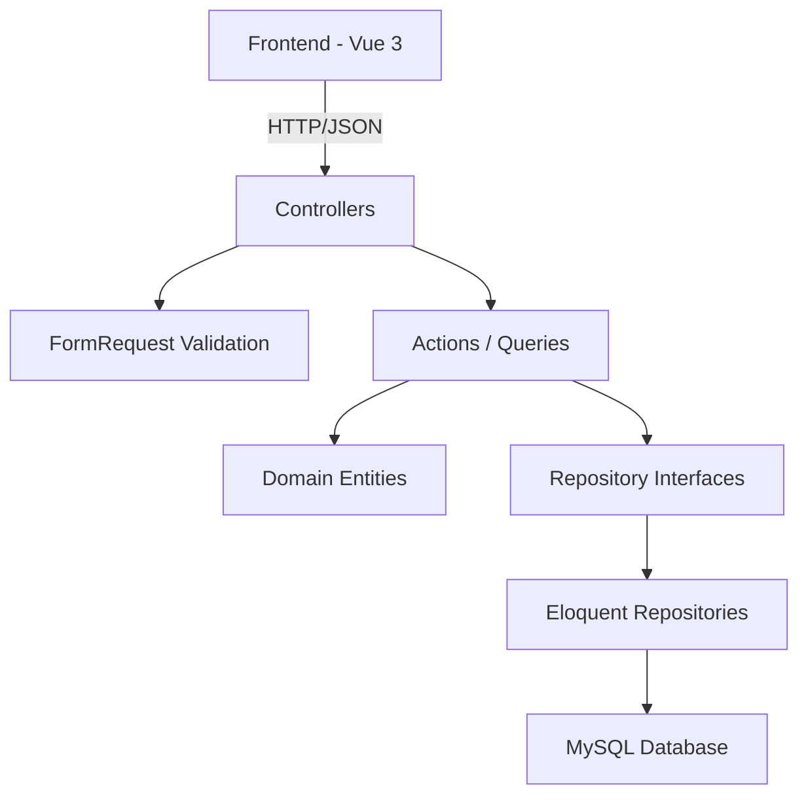

# Design Document — Accounting Module

## Overview

Modul Accounting adalah modul pembelajaran akuntansi interaktif yang mengimplementasikan double-entry bookkeeping di personal dashboard. Modul ini terpisah dari Finance (pencatatan pemasukan/pengeluaran sederhana) dan berfokus pada konsep akuntansi formal.

**Scope:**
- Chart of Accounts (COA) dengan hierarki max 3 level
- Journal Entry dengan validasi double-entry (total debit = total kredit)
- Ledger — derived view dari journal lines per account (bukan storage terpisah)
- Laporan keuangan (Trial Balance, Income Statement, Balance Sheet) — computed on-read
- Template default accounts dan sample journal entries untuk pembelajaran
- Reset functionality (partial: journal only, full: semua data)
- Per-user data isolation via `user_id`

**Key Design Decisions:**
1. Ledger bukan tabel terpisah — dihitung dari `journal_lines` yang di-join dengan `journal_entries`
2. Laporan di-generate on-read (query-time computation), tidak disimpan
3. Entry number auto-increment per user, independent dari ID database
4. Account hierarchy max 3 levels, enforced di domain layer
5. Template provisioning otomatis saat pertama kali akses (lazy initialization)

---

## Architecture

### Module Structure

```
src/Modules/Accounting/
├── Domain/
│   ├── Entities/
│   │   ├── Account.php
│   │   └── JournalEntry.php
│   ├── ValueObjects/
│   │   └── JournalLine.php
│   ├── Enums/
│   │   ├── AccountType.php
│   │   └── NormalBalance.php
│   ├── Contracts/
│   │   ├── AccountRepositoryInterface.php
│   │   └── JournalEntryRepositoryInterface.php
│   └── Exceptions/
│       ├── AccountInUseException.php
│       ├── UnbalancedEntryException.php
│       └── MaxDepthExceededException.php
│
├── Application/
│   ├── Actions/
│   │   ├── CreateAccountAction.php
│   │   ├── UpdateAccountAction.php
│   │   ├── DeleteAccountAction.php
│   │   ├── CreateJournalEntryAction.php
│   │   ├── UpdateJournalEntryAction.php
│   │   ├── DeleteJournalEntryAction.php
│   │   ├── GetLedgerAction.php
│   │   ├── GetTrialBalanceAction.php
│   │   ├── GetIncomeStatementAction.php
│   │   ├── GetBalanceSheetAction.php
│   │   ├── ProvisionDefaultAccountsAction.php
│   │   ├── LoadSampleEntriesAction.php
│   │   ├── ResetJournalDataAction.php
│   │   └── ResetAllDataAction.php
│   ├── DTO/
│   │   ├── AccountData.php
│   │   ├── JournalEntryData.php
│   │   └── JournalLineData.php
│   └── Queries/
│       ├── LedgerQuery.php
│       ├── TrialBalanceQuery.php
│       ├── IncomeStatementQuery.php
│       └── BalanceSheetQuery.php
│
└── Infrastructure/
    ├── Controllers/
    │   ├── AccountController.php
    │   ├── JournalEntryController.php
    │   ├── LedgerController.php
    │   ├── ReportController.php
    │   └── ResetController.php
    ├── Models/
    │   ├── AccountModel.php
    │   └── JournalEntryModel.php
    ├── Repositories/
    │   ├── EloquentAccountRepository.php
    │   └── EloquentJournalEntryRepository.php
    ├── Requests/
    │   ├── StoreAccountRequest.php
    │   ├── UpdateAccountRequest.php
    │   ├── StoreJournalEntryRequest.php
    │   ├── UpdateJournalEntryRequest.php
    │   └── ResetRequest.php
    ├── Resources/
    │   ├── AccountResource.php
    │   ├── JournalEntryResource.php
    │   ├── LedgerResource.php
    │   └── ReportResource.php
    ├── Providers/
    │   └── AccountingServiceProvider.php
    └── Routes/
        └── api.php
```

### Dependency Flow



### Frontend Structure

```
resources/js/pages/accounting/
├── Index.vue              → COA overview (default landing)
├── Journal.vue            → Journal entries list + create/edit
├── Ledger.vue             → Ledger per-account view
└── reports/
    ├── TrialBalance.vue   → Trial Balance report
    ├── IncomeStatement.vue → Laba Rugi report
    └── BalanceSheet.vue   → Neraca report
```

---

## Components and Interfaces

### Domain Layer

#### Entities

**Account** — Representasi satu akun di COA.

```php
class Account
{
    public function __construct(
        public ?int $id,
        public int $userId,
        public string $code,
        public string $name,
        public AccountType $type,
        public NormalBalance $normalBalance,
        public ?int $parentId = null,
        public int $depth = 1,
        public ?DateTimeImmutable $createdAt = null,
    ) {}

    public function canBeParentOf(Account $child): bool;
    public function isInUse(): bool; // determined externally
}
```

**JournalEntry** — Satu transaksi akuntansi lengkap.

```php
class JournalEntry
{
    /** @param JournalLine[] $lines */
    public function __construct(
        public ?int $id,
        public int $userId,
        public int $entryNumber,
        public DateTimeImmutable $date,
        public string $description,
        public array $lines,
        public ?DateTimeImmutable $createdAt = null,
    ) {}

    public function isBalanced(): bool;
    public function totalDebit(): float;
    public function totalCredit(): float;
    public function imbalanceAmount(): float;
}
```

#### Value Objects

**JournalLine** — Satu baris debit/kredit dalam journal entry.

```php
class JournalLine
{
    public function __construct(
        public ?int $id,
        public int $accountId,
        public float $debit,
        public float $credit,
    ) {}

    public function isDebit(): bool;
    public function isCredit(): bool;
    public function amount(): float;
}
```

#### Enums

```php
enum AccountType: string
{
    case Asset = 'asset';
    case Liability = 'liability';
    case Equity = 'equity';
    case Revenue = 'revenue';
    case Expense = 'expense';
}

enum NormalBalance: string
{
    case Debit = 'debit';
    case Credit = 'credit';
}
```

#### Contracts

```php
interface AccountRepositoryInterface
{
    public function findById(int $id): ?Account;
    public function findByCode(int $userId, string $code): ?Account;
    public function findByUser(int $userId): array;
    public function findByUserGroupedByType(int $userId): array;
    public function getDepth(int $accountId): int;
    public function hasJournalLines(int $accountId): bool;
    public function save(Account $account): Account;
    public function delete(int $id): void;
    public function countByUser(int $userId): int;
}

interface JournalEntryRepositoryInterface
{
    public function findById(int $id): ?JournalEntry;
    public function findByUserPaginated(int $userId, int $perPage = 15): array;
    public function getNextEntryNumber(int $userId): int;
    public function save(JournalEntry $entry): JournalEntry;
    public function delete(int $id): void;
    public function getLedgerForAccount(int $accountId, ?string $startDate = null, ?string $endDate = null): array;
    public function getAccountBalances(int $userId, ?string $startDate = null, ?string $endDate = null): array;
    public function deleteAllByUser(int $userId): void;
}
```

### Application Layer

#### Key Actions

| Action | Input | Output | Business Rule |
|--------|-------|--------|---------------|
| `CreateAccountAction` | `AccountData` | `Account` | Validate unique code, max depth, same-type parent |
| `UpdateAccountAction` | `id`, `AccountData` | `Account` | Immutable code & type, validate depth |
| `DeleteAccountAction` | `id` | `void` | Reject if account has journal lines |
| `CreateJournalEntryAction` | `JournalEntryData` | `JournalEntry` | Validate balance, min 2 lines, valid accounts |
| `UpdateJournalEntryAction` | `id`, `JournalEntryData` | `JournalEntry` | Re-validate balance |
| `DeleteJournalEntryAction` | `id` | `void` | Remove entry and lines |
| `ProvisionDefaultAccountsAction` | `userId` | `void` | Create template COA if none exist |
| `LoadSampleEntriesAction` | `userId` | `int` | Add ≥5 sample entries |
| `ResetJournalDataAction` | `userId` | `int` | Delete journals, keep COA |
| `ResetAllDataAction` | `userId` | `void` | Delete all, re-provision defaults |

#### Key Queries

| Query | Input | Output |
|-------|-------|--------|
| `LedgerQuery` | `accountId`, `?startDate`, `?endDate` | Lines + running balance |
| `TrialBalanceQuery` | `userId`, `?startDate`, `?endDate` | Account balances with debit/credit columns |
| `IncomeStatementQuery` | `userId`, `startDate`, `endDate` | Revenue, Expense, Net Income |
| `BalanceSheetQuery` | `userId`, `asOfDate` | Assets, Liabilities, Equity + equation check |

### Infrastructure — API Endpoints

| Method | Endpoint | Controller | Purpose |
|--------|----------|------------|---------|
| GET | `/api/accounting/accounts` | AccountController@index | List COA (tree) |
| POST | `/api/accounting/accounts` | AccountController@store | Create account |
| PUT | `/api/accounting/accounts/{id}` | AccountController@update | Update account |
| DELETE | `/api/accounting/accounts/{id}` | AccountController@destroy | Delete account |
| GET | `/api/accounting/journal-entries` | JournalEntryController@index | List entries (paginated) |
| POST | `/api/accounting/journal-entries` | JournalEntryController@store | Create entry |
| GET | `/api/accounting/journal-entries/{id}` | JournalEntryController@show | Get entry detail |
| PUT | `/api/accounting/journal-entries/{id}` | JournalEntryController@update | Update entry |
| DELETE | `/api/accounting/journal-entries/{id}` | JournalEntryController@destroy | Delete entry |
| GET | `/api/accounting/ledger/{accountId}` | LedgerController@show | Get ledger for account |
| GET | `/api/accounting/reports/trial-balance` | ReportController@trialBalance | Trial Balance |
| GET | `/api/accounting/reports/income-statement` | ReportController@incomeStatement | Income Statement |
| GET | `/api/accounting/reports/balance-sheet` | ReportController@balanceSheet | Balance Sheet |
| POST | `/api/accounting/reset/journal` | ResetController@resetJournal | Reset journal data |
| POST | `/api/accounting/reset/all` | ResetController@resetAll | Full reset |
| POST | `/api/accounting/sample-data` | ResetController@loadSample | Load sample entries |

---

## Data Models

### Database Schema

#### `accounting_accounts` table

| Column | Type | Constraints |
|--------|------|-------------|
| id | bigint unsigned | PK, auto-increment |
| user_id | bigint unsigned | NOT NULL, index |
| code | varchar(10) | NOT NULL |
| name | varchar(100) | NOT NULL |
| type | varchar(20) | NOT NULL (asset, liability, equity, revenue, expense) |
| normal_balance | varchar(10) | NOT NULL (debit, credit) |
| parent_id | bigint unsigned | NULLABLE |
| depth | tinyint unsigned | NOT NULL, default 1 |
| created_at | timestamp | NULLABLE |
| updated_at | timestamp | NULLABLE |

**Indexes:** `unique(user_id, code)`, `index(user_id, type)`, `index(parent_id)`

#### `accounting_journal_entries` table

| Column | Type | Constraints |
|--------|------|-------------|
| id | bigint unsigned | PK, auto-increment |
| user_id | bigint unsigned | NOT NULL, index |
| entry_number | int unsigned | NOT NULL |
| date | date | NOT NULL |
| description | varchar(255) | NOT NULL |
| total_debit | decimal(15,2) | NOT NULL |
| created_at | timestamp | NULLABLE |
| updated_at | timestamp | NULLABLE |

**Indexes:** `unique(user_id, entry_number)`, `index(user_id, date)`

#### `accounting_journal_lines` table

| Column | Type | Constraints |
|--------|------|-------------|
| id | bigint unsigned | PK, auto-increment |
| journal_entry_id | bigint unsigned | NOT NULL, index |
| account_id | bigint unsigned | NOT NULL, index |
| debit | decimal(15,2) | NOT NULL, default 0 |
| credit | decimal(15,2) | NOT NULL, default 0 |

**Indexes:** `index(journal_entry_id)`, `index(account_id)`

### Entity-Model Mapping

| Domain | Database |
|--------|----------|
| `Account` entity | `AccountModel` → `accounting_accounts` |
| `JournalEntry` entity | `JournalEntryModel` → `accounting_journal_entries` + `accounting_journal_lines` |
| `JournalLine` VO | Embedded in `JournalEntryModel` relationship |

### Ledger Computation (Derived, No Table)

Ledger data dihitung real-time dari query:

```sql
SELECT jl.*, je.date, je.entry_number, je.description
FROM accounting_journal_lines jl
JOIN accounting_journal_entries je ON je.id = jl.journal_entry_id
WHERE jl.account_id = ?
  AND je.user_id = ?
  [AND je.date BETWEEN ? AND ?]
ORDER BY je.date ASC, je.id ASC
```

Running balance dihitung secara kumulatif di application layer berdasarkan `normal_balance` account.

### Report Computation (Derived, No Table)

Semua laporan dihitung on-read:

- **Trial Balance:** `SUM(debit) - SUM(credit)` per account, pivoted by normal balance
- **Income Statement:** Filter by Revenue & Expense types within fiscal period
- **Balance Sheet:** Cumulative balances for Asset/Liability/Equity, dengan Net Income injected dari income statement calculation

### Default Template Accounts

Template accounts yang akan di-provision saat pertama kali akses:

| Code | Name | Type |
|------|------|------|
| 1000 | Kas | Asset |
| 1100 | Bank | Asset |
| 1200 | Piutang Usaha | Asset |
| 1300 | Perlengkapan | Asset |
| 1400 | Peralatan | Asset |
| 2000 | Utang Usaha | Liability |
| 2100 | Utang Bank | Liability |
| 3000 | Modal | Equity |
| 3100 | Prive | Equity |
| 4000 | Pendapatan Jasa | Revenue |
| 4100 | Pendapatan Lain-lain | Revenue |
| 5000 | Beban Gaji | Expense |
| 5100 | Beban Sewa | Expense |
| 5200 | Beban Listrik | Expense |
| 5300 | Beban Perlengkapan | Expense |
| 5400 | Beban Lain-lain | Expense |

---

## Correctness Properties

*A property is a characteristic or behavior that should hold true across all valid executions of a system — essentially, a formal statement about what the system should do. Properties serve as the bridge between human-readable specifications and machine-verifiable correctness guarantees.*

### Property 1: Normal Balance Assignment

*For any* AccountType, the assigned NormalBalance SHALL be Debit when the type is Asset or Expense, and Credit when the type is Liability, Equity, or Revenue.

**Validates: Requirements 1.3**

### Property 2: Account Immutability on Update

*For any* existing Account and any update operation, the account's `code` and `type` fields SHALL remain unchanged after the update, regardless of what values are submitted.

**Validates: Requirements 1.4**

### Property 3: Account Deletion Prevention

*For any* Account that has at least one JournalLine referencing it, the delete operation SHALL be rejected.

**Validates: Requirements 1.5**

### Property 4: Account Code Uniqueness

*For any* user, no two Accounts SHALL have the same `code`. Creating an Account with a code that already exists for that user SHALL be rejected.

**Validates: Requirements 1.6**

### Property 5: Account Hierarchy Constraints

*For any* Account assignment of a parent, the parent Account SHALL have the same AccountType as the child, and the resulting depth SHALL not exceed 3 levels.

**Validates: Requirements 1.8**

### Property 6: Double-Entry Balance Invariant

*For any* JournalEntry (creation or update), the entry SHALL be accepted if and only if the sum of all debit amounts equals the sum of all credit amounts across its JournalLines. When rejected, the reported imbalance amount SHALL equal the absolute difference between total debit and total credit.

**Validates: Requirements 2.2, 2.3, 2.7**

### Property 7: Journal Entry Ledger Round-Trip

*For any* valid JournalEntry that is saved, querying the ledger for each referenced Account SHALL include the corresponding line amounts. Conversely, deleting a JournalEntry SHALL remove those line amounts from each Account's ledger.

**Validates: Requirements 2.4, 2.8**

### Property 8: Sequential Entry Numbering

*For any* sequence of JournalEntry creations for a given user, each new entry number SHALL equal the previous maximum entry number plus one, starting from 1. Entry numbers SHALL never be reused regardless of deletions.

**Validates: Requirements 2.9**

### Property 9: Running Balance Computation

*For any* Account and its JournalLines in chronological order, the running balance after each line SHALL be computed by: adding debit and subtracting credit for Debit NormalBalance accounts, or adding credit and subtracting debit for Credit NormalBalance accounts. When filtered by date range, the opening balance SHALL equal the cumulative sum of all lines dated before the start of the range.

**Validates: Requirements 3.2, 3.3, 3.4**

### Property 10: Trial Balance Always Balanced

*For any* set of JournalEntries where each individual entry satisfies the double-entry balance invariant (Property 6), the resulting Trial Balance SHALL have total debit equal to total credit (always "Balanced").

**Validates: Requirements 4.3**

### Property 11: Net Income Computation

*For any* fiscal period, the Income Statement's Net Income SHALL equal the sum of all Revenue account balances minus the sum of all Expense account balances within that period.

**Validates: Requirements 5.1, 5.2, 5.3**

### Property 12: Accounting Equation Invariant

*For any* set of balanced JournalEntries and any selected date, the Balance Sheet SHALL satisfy: Total Assets = Total Liabilities + Total Equity (where Equity includes Net Income for the fiscal period containing the selected date).

**Validates: Requirements 6.1, 6.2, 6.3, 6.4**

### Property 13: Partial Reset Preserves Accounts

*For any* state with Accounts and JournalEntries, after a partial reset (journal only), the Account count SHALL remain unchanged and the JournalEntry count SHALL be zero.

**Validates: Requirements 7.1**

### Property 14: Full Reset Restores Default State

*For any* state, after a full reset, only the default template Accounts SHALL exist (covering all 5 types) and no JournalEntries SHALL exist.

**Validates: Requirements 7.2**

### Property 15: Sample Data Load Is Additive

*For any* existing state, after loading sample entries, all previously existing JournalEntries SHALL still exist and at least 5 new JournalEntries SHALL have been added.

**Validates: Requirements 7.5**

---

## Error Handling

### Domain-Level Exceptions

| Exception | Trigger | HTTP Code |
|-----------|---------|-----------|
| `UnbalancedEntryException` | Debit ≠ Credit saat save journal entry | 422 |
| `AccountInUseException` | Attempt delete account yang punya journal lines | 409 |
| `MaxDepthExceededException` | Parent assignment melebihi 3 levels | 422 |
| `DuplicateAccountCodeException` | Account code sudah ada untuk user | 422 |
| `InvalidAccountReferenceException` | Journal line references non-existent account | 422 |

### Validation Errors (FormRequest)

| Field | Rule | Message (Bahasa Indonesia) |
|-------|------|---------------------------|
| `code` | required, alphanumeric, 1-10 chars, unique per user | "Kode akun wajib diisi (1-10 karakter alfanumerik)" |
| `name` | required, string, 1-100 chars | "Nama akun wajib diisi (maks 100 karakter)" |
| `type` | required, in: asset,liability,equity,revenue,expense | "Tipe akun tidak valid" |
| `description` | required, string, max 255 | "Deskripsi wajib diisi (maks 255 karakter)" |
| `date` | required, date format Y-m-d | "Tanggal tidak valid" |
| `lines` | required, array, min:2, max:20 | "Minimal 2 baris jurnal, maksimal 20" |
| `lines.*.account_id` | required, exists in accounts | "Akun tidak ditemukan" |
| `lines.*.debit` | numeric, min:0, max:9999999999999.99 | "Jumlah debit tidak valid" |
| `lines.*.credit` | numeric, min:0, max:9999999999999.99 | "Jumlah kredit tidak valid" |

### Transaction Safety

- Reset operations (partial/full) MUST use database transactions
- If any part of the reset fails, rollback seluruh perubahan
- Journal entry save (entry + lines) dalam satu transaction

### API Error Response Format

```json
{
  "message": "Total debit tidak sama dengan total kredit",
  "errors": {
    "balance": ["Selisih: Rp 50.000"]
  }
}
```

---

## Testing Strategy

### Dual Testing Approach

Modul ini menggunakan kombinasi:
1. **Feature tests (Laravel)** — full HTTP flow (request → action → database → response)
2. **Property-based tests (PHP)** — universal properties untuk domain logic

### Feature Tests (`tests/Feature/Accounting/`)

| Test Class | Coverage |
|------------|----------|
| `AccountCrudTest` | CRUD accounts, validation, authorization, ownership |
| `JournalEntryCrudTest` | CRUD journal entries, balance validation, line rules |
| `LedgerTest` | Ledger computation, date filtering, running balance |
| `TrialBalanceTest` | Trial balance report, fiscal period filtering |
| `IncomeStatementTest` | Revenue/expense computation, net income |
| `BalanceSheetTest` | Cumulative balances, accounting equation |
| `ResetTest` | Partial reset, full reset, sample data loading |
| `ProvisioningTest` | Default account provisioning on first access |

### Property-Based Tests

**Library:** [phpunit/phpunit](https://phpunit.de/) with a custom property test helper using data providers that generate random inputs (100+ iterations per property).

**Configuration:**
- Minimum 100 iterations per property
- Each test tagged with property reference comment

**Property test mapping:**

| Property | Test Method | Generator |
|----------|-------------|-----------|
| P1: Normal Balance Assignment | `test_normal_balance_assigned_correctly` | Random AccountType |
| P6: Double-Entry Balance | `test_balanced_entries_accepted_unbalanced_rejected` | Random sets of JournalLines (balanced & unbalanced) |
| P8: Sequential Numbering | `test_entry_numbers_sequential` | Random create/delete sequences |
| P9: Running Balance | `test_running_balance_computation` | Random Account + JournalLines sequence |
| P10: Trial Balance Balanced | `test_trial_balance_always_balanced` | Random balanced JournalEntries |
| P11: Net Income | `test_net_income_equals_revenue_minus_expense` | Random Revenue/Expense entries |
| P12: Accounting Equation | `test_accounting_equation_holds` | Random balanced entries across all types |

**Tag format:**
```php
// Feature: accounting, Property 6: For any JournalEntry, accepted IFF total debit equals total credit
```

### Unit Tests vs Property Tests Balance

- **Unit tests** cover: specific edge cases (zero balance, max depth, empty period), integration points (API response format, FormRequest validation), authorization (401/403)
- **Property tests** cover: universal invariants (balance, running balance, accounting equation), computation correctness across random inputs

### Test Data Strategy

- Use factories for Account and JournalEntry/JournalLine generation
- Random amount generation: `0.01` to `999999.99` (practical range)
- Random account codes: alphanumeric strings 1-10 chars
- Random dates within a 1-year window

