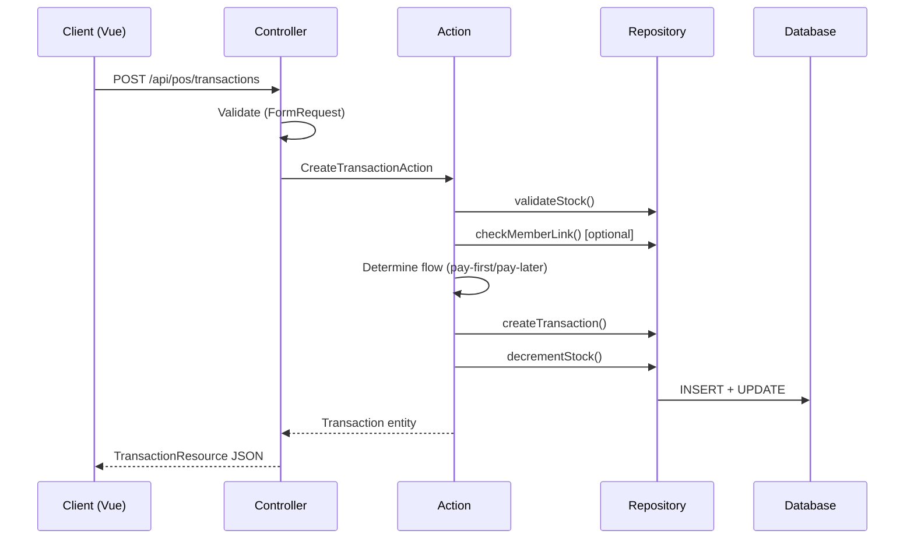
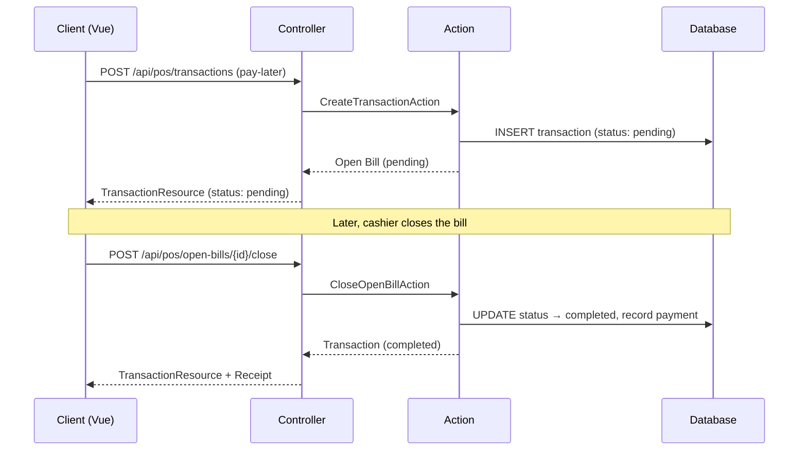
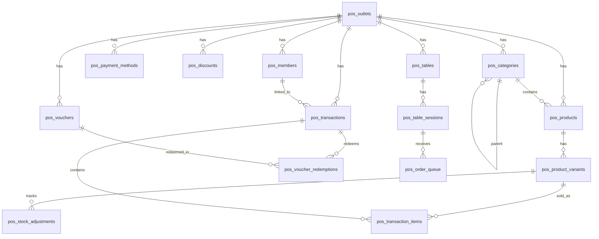

# Design Document — POS (Point of Sale) Module

## Overview

The POS module is a self-contained DDD module (`src/Modules/Pos/`) that provides multi-format point-of-sale capabilities for small businesses. It follows the established 3-layer architecture (Domain → Application → Infrastructure) and integrates with the existing personal dashboard ecosystem.

### Design Decisions

1. **Single module namespace `Pos`** — All POS sub-modules (Catalog, Transaction, Discount, Voucher, QR Order, Outlet, Report, Customer) live under `Modules\Pos` with sub-namespaces, keeping the top-level module list clean while allowing internal separation.
2. **Outlet-scoped data** — All POS data is scoped to both `user_id` (ownership) and `outlet_id` (multi-outlet). This enables future multi-outlet support without schema changes. Members are also scoped to outlet.
3. **Cart as ephemeral state** — Cart lives in frontend state (Pinia store) and is submitted as a complete payload during checkout. No server-side cart persistence needed for this use case.
4. **QR ordering as public route** — QR order pages are unauthenticated public routes with session tokens, separate from the Sanctum-authenticated API. QR orders always default to pay-later flow.
5. **All monetary values stored as `decimal(15,2)`** — Consistent with the Finance module pattern.
6. **Table prefix `pos_`** — All POS tables use `pos_` prefix to avoid naming collisions.
7. **Two customer types** — Walk-in (anonymous) and Member (registered). Transactions optionally link to a member; failure to link gracefully degrades to walk-in.
8. **Configurable payment flow** — Outlets choose pay-first, pay-later, or both. Pay-later creates Open Bills (pending transactions) that cashiers close later. QR orders always use pay-later regardless of outlet setting.
9. **Graceful degradation** — Priority ordering failure in discounts applies individual discounts without ordering. Member linking failure defaults to walk-in. Product deactivation forces exclusion even on operation errors.

## Architecture

### Module Structure

```
src/Modules/Pos/
├── Domain/
│   ├── Entities/
│   │   ├── Outlet.php
│   │   ├── Category.php
│   │   ├── Product.php
│   │   ├── ProductVariant.php
│   │   ├── StockAdjustment.php
│   │   ├── Transaction.php
│   │   ├── TransactionItem.php
│   │   ├── Discount.php
│   │   ├── Voucher.php
│   │   ├── VoucherRedemption.php
│   │   ├── Table.php
│   │   ├── TableSession.php
│   │   ├── OrderQueue.php
│   │   ├── PaymentMethod.php
│   │   └── Member.php
│   ├── Enums/
│   │   ├── BusinessType.php
│   │   ├── ProductStatus.php
│   │   ├── TransactionStatus.php
│   │   ├── DiscountType.php
│   │   ├── PaymentMethodType.php
│   │   ├── PaymentFlowMode.php
│   │   ├── StockAdjustmentType.php
│   │   ├── OrderStatus.php
│   │   └── TableSessionStatus.php
│   ├── Contracts/
│   │   ├── OutletRepositoryInterface.php
│   │   ├── CategoryRepositoryInterface.php
│   │   ├── ProductRepositoryInterface.php
│   │   ├── TransactionRepositoryInterface.php
│   │   ├── DiscountRepositoryInterface.php
│   │   ├── VoucherRepositoryInterface.php
│   │   ├── TableRepositoryInterface.php
│   │   ├── MemberRepositoryInterface.php
│   │   └── ReportRepositoryInterface.php
│   └── Exceptions/
│       ├── InsufficientStockException.php
│       ├── InvalidVoucherException.php
│       ├── InvalidStockAdjustmentException.php
│       ├── DuplicateProductException.php
│       ├── DuplicateCategoryException.php
│       └── VoidNotAllowedException.php
│
├── Application/
│   ├── Actions/
│   │   ├── Outlet/
│   │   │   ├── CreateOutletAction.php
│   │   │   ├── UpdateOutletAction.php
│   │   │   └── DeleteOutletAction.php
│   │   ├── Catalog/
│   │   │   ├── CreateCategoryAction.php
│   │   │   ├── UpdateCategoryAction.php
│   │   │   ├── DeleteCategoryAction.php
│   │   │   ├── ReorderCategoryAction.php
│   │   │   ├── CreateProductAction.php
│   │   │   ├── UpdateProductAction.php
│   │   │   ├── DeactivateProductAction.php
│   │   │   └── AdjustStockAction.php
│   │   ├── Transaction/
│   │   │   ├── CreateTransactionAction.php
│   │   │   ├── VoidTransactionAction.php
│   │   │   ├── CloseOpenBillAction.php
│   │   │   └── GenerateReceiptAction.php
│   │   ├── Discount/
│   │   │   ├── CreateDiscountAction.php
│   │   │   ├── UpdateDiscountAction.php
│   │   │   ├── DeleteDiscountAction.php
│   │   │   └── EvaluateDiscountsAction.php
│   │   ├── Voucher/
│   │   │   ├── CreateVoucherAction.php
│   │   │   ├── BatchCreateVoucherAction.php
│   │   │   ├── RedeemVoucherAction.php
│   │   │   └── ValidateVoucherAction.php
│   │   ├── Member/
│   │   │   ├── CreateMemberAction.php
│   │   │   ├── UpdateMemberAction.php
│   │   │   └── DeleteMemberAction.php
│   │   └── QrOrder/
│   │       ├── CreateTableAction.php
│   │       ├── GenerateQrCodeAction.php
│   │       ├── SubmitOrderAction.php
│   │       ├── AcceptOrderAction.php
│   │       └── CloseTableSessionAction.php
│   ├── DTO/
│   │   ├── OutletData.php
│   │   ├── CategoryData.php
│   │   ├── ProductData.php
│   │   ├── ProductVariantData.php
│   │   ├── CheckoutData.php
│   │   ├── LineItemData.php
│   │   ├── DiscountData.php
│   │   ├── VoucherData.php
│   │   ├── StockAdjustmentData.php
│   │   ├── MemberData.php
│   │   └── QrOrderData.php
│   └── Queries/
│       ├── DailySalesReportQuery.php
│       ├── DateRangeSalesReportQuery.php
│       ├── ProductRankingQuery.php
│       ├── RevenueByPaymentMethodQuery.php
│       └── OpenBillsQuery.php
│
└── Infrastructure/
    ├── Controllers/
    │   ├── OutletController.php
    │   ├── CategoryController.php
    │   ├── ProductController.php
    │   ├── StockController.php
    │   ├── TransactionController.php
    │   ├── OpenBillController.php
    │   ├── PaymentMethodController.php
    │   ├── DiscountController.php
    │   ├── VoucherController.php
    │   ├── MemberController.php
    │   ├── TableController.php
    │   ├── OrderQueueController.php
    │   ├── ReportController.php
    │   ├── ReceiptController.php
    │   └── QrOrderPublicController.php  ← public (no auth)
    ├── Models/
    │   ├── OutletModel.php
    │   ├── CategoryModel.php
    │   ├── ProductModel.php
    │   ├── ProductVariantModel.php
    │   ├── TransactionModel.php
    │   ├── TransactionItemModel.php
    │   ├── DiscountModel.php
    │   ├── VoucherModel.php
    │   ├── VoucherRedemptionModel.php
    │   ├── PaymentMethodModel.php
    │   ├── StockAdjustmentModel.php
    │   ├── MemberModel.php
    │   ├── TableModel.php
    │   ├── TableSessionModel.php
    │   └── OrderQueueModel.php
    ├── Repositories/
    │   ├── EloquentOutletRepository.php
    │   ├── EloquentCategoryRepository.php
    │   ├── EloquentProductRepository.php
    │   ├── EloquentTransactionRepository.php
    │   ├── EloquentDiscountRepository.php
    │   ├── EloquentVoucherRepository.php
    │   ├── EloquentTableRepository.php
    │   ├── EloquentMemberRepository.php
    │   └── EloquentReportRepository.php
    ├── Requests/
    │   ├── StoreOutletRequest.php
    │   ├── UpdateOutletRequest.php
    │   ├── StoreCategoryRequest.php
    │   ├── UpdateCategoryRequest.php
    │   ├── StoreProductRequest.php
    │   ├── UpdateProductRequest.php
    │   ├── StoreStockAdjustmentRequest.php
    │   ├── StoreTransactionRequest.php
    │   ├── VoidTransactionRequest.php
    │   ├── CloseOpenBillRequest.php
    │   ├── StoreDiscountRequest.php
    │   ├── UpdateDiscountRequest.php
    │   ├── StoreVoucherRequest.php
    │   ├── BatchStoreVoucherRequest.php
    │   ├── RedeemVoucherRequest.php
    │   ├── StoreMemberRequest.php
    │   ├── UpdateMemberRequest.php
    │   ├── StoreTableRequest.php
    │   └── SubmitQrOrderRequest.php
    ├── Resources/
    │   ├── OutletResource.php
    │   ├── CategoryResource.php
    │   ├── ProductResource.php
    │   ├── ProductVariantResource.php
    │   ├── TransactionResource.php
    │   ├── TransactionItemResource.php
    │   ├── DiscountResource.php
    │   ├── VoucherResource.php
    │   ├── MemberResource.php
    │   ├── TableResource.php
    │   ├── OrderQueueResource.php
    │   ├── ReportResource.php
    │   └── ReceiptResource.php
    ├── Providers/
    │   └── PosServiceProvider.php
    └── Routes/
        ├── api.php            ← authenticated routes
        └── public.php         ← QR order public routes
```

### Sub-Module Interaction Diagram

```mermaid
graph TB
    subgraph "POS Module"
        Outlet[Outlet Management]
        Catalog[Catalog<br>Categories + Products + Stock]
        Transaction[Transaction<br>Cart + Checkout + Payment]
        Discount[Discount Engine]
        Voucher[Voucher Service]
        QrOrder[QR Order Service]
        Member[Customer Management<br>Walk-in + Member]
        Report[Reporting]
    end

    Outlet -->|outlet_id scopes| Catalog
    Outlet -->|outlet_id scopes| Transaction
    Outlet -->|outlet_id scopes| QrOrder
    Outlet -->|outlet_id scopes| Member
    Outlet -->|payment_flow config| Transaction
    Catalog -->|product data| Transaction
    Catalog -->|stock validation| Transaction
    Discount -->|applies to| Transaction
    Discount -->|member_only check| Member
    Voucher -->|redeems in| Transaction
    Member -->|links to| Transaction
    QrOrder -->|creates (pay-later)| Transaction
    Transaction -->|feeds data| Report
    Catalog -->|menu data| QrOrder
```

### Request Flow



### Pay-Later (Open Bill) Flow



## Components and Interfaces

### Domain Contracts

```php
interface OutletRepositoryInterface {
    public function findById(int $id): ?Outlet;
    public function findByUser(int $userId): array;
    public function create(int $userId, OutletData $data): Outlet;
    public function update(int $id, OutletData $data): Outlet;
    public function softDelete(int $id): void;
}

interface CategoryRepositoryInterface {
    public function findByOutlet(int $outletId): array;
    public function findById(int $id): ?Category;
    public function create(int $outletId, CategoryData $data): Category;
    public function update(int $id, CategoryData $data): Category;
    public function delete(int $id): void;
    public function reorder(array $orderedIds): void;
    public function existsByName(int $outletId, string $name, ?int $excludeId = null): bool;
}

interface ProductRepositoryInterface {
    public function findByOutletPaginated(int $outletId, array $filters, int $perPage): array;
    public function findById(int $id): ?Product;
    public function findActiveByOutlet(int $outletId): array;
    public function create(int $outletId, ProductData $data): Product;
    public function update(int $id, ProductData $data): Product;
    public function deactivate(int $id): void;
    public function existsByName(int $outletId, int $categoryId, string $name, ?int $excludeId = null): bool;
    public function adjustStock(int $variantId, int $quantity, string $type, string $reason): void;
    public function decrementStock(int $variantId, int $quantity): void;
    public function getStockLevel(int $variantId): int;
}

interface TransactionRepositoryInterface {
    public function findByOutletPaginated(int $outletId, array $filters, int $perPage): array;
    public function findById(int $id): ?Transaction;
    public function create(int $outletId, CheckoutData $data): Transaction;
    public function void(int $id, string $reason): Transaction;
    public function generateTransactionNumber(int $outletId): string;
    public function findOpenBillsByOutlet(int $outletId): array;
    public function closeOpenBill(int $id, string $paymentMethod, string $paymentMethodType, ?float $amountTendered): Transaction;
}

interface DiscountRepositoryInterface {
    public function findByOutlet(int $outletId): array;
    public function findActiveByOutlet(int $outletId): array;
    public function findById(int $id): ?Discount;
    public function create(int $outletId, DiscountData $data): Discount;
    public function update(int $id, DiscountData $data): Discount;
    public function delete(int $id): void;
    public function findApplicable(int $outletId, float $subtotal, ?int $memberId = null): array;
}

interface VoucherRepositoryInterface {
    public function findByOutletPaginated(int $outletId, int $perPage): array;
    public function findByCode(string $code): ?Voucher;
    public function findById(int $id): ?Voucher;
    public function create(int $outletId, VoucherData $data): Voucher;
    public function batchCreate(int $outletId, array $vouchers): array;
    public function incrementUsage(int $id): void;
    public function recordRedemption(int $voucherId, int $transactionId): void;
}

interface TableRepositoryInterface {
    public function findByOutlet(int $outletId): array;
    public function findById(int $id): ?Table;
    public function create(int $outletId, string $name): Table;
    public function delete(int $id): void;
    public function createSession(int $tableId): TableSession;
    public function closeSession(int $sessionId): void;
    public function findActiveSession(int $tableId): ?TableSession;
    public function addToOrderQueue(int $sessionId, QrOrderData $data): OrderQueue;
    public function findPendingOrders(int $outletId): array;
    public function acceptOrder(int $orderId): OrderQueue;
}

interface ReportRepositoryInterface {
    public function getDailySummary(int $outletId, string $date): array;
    public function getDateRangeSummary(int $outletId, string $from, string $to): array;
    public function getProductRanking(int $outletId, string $from, string $to, int $limit): array;
    public function getRevenueByPaymentMethod(int $outletId, string $from, string $to): array;
    public function getDashboardStats(int $outletId): array;
}

interface MemberRepositoryInterface {
    public function findByOutletPaginated(int $outletId, array $filters, int $perPage): array;
    public function findByOutlet(int $outletId): array;
    public function findById(int $id): ?Member;
    public function create(int $outletId, MemberData $data): Member;
    public function update(int $id, MemberData $data): Member;
    public function delete(int $id): void;
    public function search(int $outletId, string $query): array;
}
```

### Domain Enums

```php
enum BusinessType: string {
    case Retail = 'retail';
    case Warung = 'warung';
    case Kafe = 'kafe';
    case Warkop = 'warkop';
}

enum ProductStatus: string {
    case Active = 'active';
    case Inactive = 'inactive';
}

enum TransactionStatus: string {
    case Completed = 'completed';
    case Pending = 'pending';
    case Voided = 'voided';
}

enum DiscountType: string {
    case Percentage = 'percentage';
    case Fixed = 'fixed';
    case BuyXGetY = 'buy_x_get_y';
}

enum PaymentMethodType: string {
    case Cash = 'cash';
    case BankTransfer = 'bank_transfer';
    case EWallet = 'e_wallet';
    case Custom = 'custom';
}

enum PaymentFlowMode: string {
    case PayFirst = 'pay_first';
    case PayLater = 'pay_later';
    case Both = 'both';
}

enum StockAdjustmentType: string {
    case Restock = 'restock';
    case Correction = 'correction';
    case Sale = 'sale';
    case Void = 'void';
}

enum OrderStatus: string {
    case Pending = 'pending';
    case Accepted = 'accepted';
    case Completed = 'completed';
    case Cancelled = 'cancelled';
}

enum TableSessionStatus: string {
    case Active = 'active';
    case Closed = 'closed';
}
```

### Key Domain Entities

```php
class Outlet {
    public function __construct(
        public ?int $id,
        public int $userId,
        public string $name,
        public BusinessType $businessType,
        public PaymentFlowMode $paymentFlow = PaymentFlowMode::PayFirst,
        public ?string $address = null,
        public ?string $phone = null,
        public ?array $settings = null,
        public ?DateTimeImmutable $createdAt = null,
        public ?DateTimeImmutable $deletedAt = null,
    ) {}

    public function supportsTableOrdering(): bool
    {
        return in_array($this->businessType, [BusinessType::Kafe, BusinessType::Warkop]);
    }

    public function supportsPayLater(): bool
    {
        return in_array($this->paymentFlow, [PaymentFlowMode::PayLater, PaymentFlowMode::Both]);
    }
}

class Product {
    public function __construct(
        public ?int $id,
        public int $outletId,
        public int $categoryId,
        public string $name,
        public decimal $basePrice,
        public ProductStatus $status = ProductStatus::Active,
        public ?string $sku = null,
        public ?string $image = null,
        public bool $hasVariants = false,
        public bool $trackStock = true,
        /** @var ProductVariant[] */
        public array $variants = [],
    ) {}

    public function isActive(): bool
    {
        return $this->status === ProductStatus::Active;
    }
}

class Transaction {
    public function __construct(
        public ?int $id,
        public int $outletId,
        public string $transactionNumber,
        public decimal $subtotal,
        public decimal $discountAmount,
        public decimal $total,
        public ?string $paymentMethod = null,
        public ?decimal $amountTendered = null,
        public ?decimal $changeAmount = null,
        public TransactionStatus $status = TransactionStatus::Completed,
        public ?string $voidReason = null,
        public ?int $memberId = null,
        public ?int $tableSessionId = null,
        public ?string $voucherCode = null,
        /** @var TransactionItem[] */
        public array $items = [],
        public ?DateTimeImmutable $createdAt = null,
        public ?DateTimeImmutable $voidedAt = null,
    ) {}

    public function isVoided(): bool
    {
        return $this->status === TransactionStatus::Voided;
    }

    public function isPending(): bool
    {
        return $this->status === TransactionStatus::Pending;
    }

    public function isOverdue(): bool
    {
        if (!$this->isPending() || $this->createdAt === null) {
            return false;
        }
        $threshold = new DateTimeImmutable('-24 hours');
        return $this->createdAt < $threshold;
    }

    public function canVoidWithoutConfirmation(): bool
    {
        $threshold = new DateTimeImmutable('-24 hours');
        return $this->createdAt >= $threshold;
    }

    public function isLinkedToMember(): bool
    {
        return $this->memberId !== null;
    }
}
```

```php
class Member {
    public function __construct(
        public ?int $id,
        public int $outletId,
        public string $name,
        public string $phone,
        public ?string $email = null,
        public ?DateTimeImmutable $createdAt = null,
        public ?DateTimeImmutable $updatedAt = null,
    ) {}
}
```

### API Endpoints

All authenticated routes are prefixed with `/api/pos/` and require `auth:sanctum` middleware.

#### Outlet

| Method | Endpoint | Controller Method | Description |
|--------|----------|-------------------|-------------|
| GET | `/pos/outlets` | index | List user's outlets |
| POST | `/pos/outlets` | store | Create outlet |
| PUT | `/pos/outlets/{id}` | update | Update outlet |
| DELETE | `/pos/outlets/{id}` | destroy | Soft-delete outlet |

#### Categories

| Method | Endpoint | Controller Method | Description |
|--------|----------|-------------------|-------------|
| GET | `/pos/outlets/{outletId}/categories` | index | List categories |
| POST | `/pos/outlets/{outletId}/categories` | store | Create category |
| PUT | `/pos/categories/{id}` | update | Update category |
| DELETE | `/pos/categories/{id}` | destroy | Delete category |
| POST | `/pos/categories/reorder` | reorder | Reorder categories |

#### Products

| Method | Endpoint | Controller Method | Description |
|--------|----------|-------------------|-------------|
| GET | `/pos/outlets/{outletId}/products` | index | List products (paginated, searchable) |
| POST | `/pos/outlets/{outletId}/products` | store | Create product with variants |
| GET | `/pos/products/{id}` | show | Get product detail |
| PUT | `/pos/products/{id}` | update | Update product |
| PATCH | `/pos/products/{id}/deactivate` | deactivate | Deactivate product |

#### Stock

| Method | Endpoint | Controller Method | Description |
|--------|----------|-------------------|-------------|
| POST | `/pos/products/{id}/stock-adjustments` | store | Create stock adjustment |
| GET | `/pos/outlets/{outletId}/stock` | index | Stock levels overview |

#### Transactions

| Method | Endpoint | Controller Method | Description |
|--------|----------|-------------------|-------------|
| GET | `/pos/outlets/{outletId}/transactions` | index | Transaction history (paginated, filterable) |
| POST | `/pos/outlets/{outletId}/transactions` | store | Create transaction (checkout) |
| GET | `/pos/transactions/{id}` | show | Transaction detail |
| POST | `/pos/transactions/{id}/void` | void | Void transaction |

#### Open Bills

| Method | Endpoint | Controller Method | Description |
|--------|----------|-------------------|-------------|
| GET | `/pos/outlets/{outletId}/open-bills` | index | List pending open bills |
| POST | `/pos/open-bills/{id}/close` | close | Close open bill with payment |

#### Members

| Method | Endpoint | Controller Method | Description |
|--------|----------|-------------------|-------------|
| GET | `/pos/outlets/{outletId}/members` | index | List members (paginated, searchable) |
| POST | `/pos/outlets/{outletId}/members` | store | Create member |
| GET | `/pos/members/{id}` | show | Get member detail |
| PUT | `/pos/members/{id}` | update | Update member |
| DELETE | `/pos/members/{id}` | destroy | Delete member |
| GET | `/pos/outlets/{outletId}/members/search` | search | Quick search by name/phone |

#### Payment Methods

| Method | Endpoint | Controller Method | Description |
|--------|----------|-------------------|-------------|
| GET | `/pos/outlets/{outletId}/payment-methods` | index | List enabled payment methods |
| POST | `/pos/outlets/{outletId}/payment-methods` | store | Add/configure payment method |
| PUT | `/pos/payment-methods/{id}` | update | Update payment method |
| DELETE | `/pos/payment-methods/{id}` | destroy | Remove payment method |

#### Discounts

| Method | Endpoint | Controller Method | Description |
|--------|----------|-------------------|-------------|
| GET | `/pos/outlets/{outletId}/discounts` | index | List discount rules |
| POST | `/pos/outlets/{outletId}/discounts` | store | Create discount rule |
| PUT | `/pos/discounts/{id}` | update | Update discount rule |
| DELETE | `/pos/discounts/{id}` | destroy | Delete discount rule |
| POST | `/pos/discounts/evaluate` | evaluate | Evaluate applicable discounts for cart |

#### Vouchers

| Method | Endpoint | Controller Method | Description |
|--------|----------|-------------------|-------------|
| GET | `/pos/outlets/{outletId}/vouchers` | index | List vouchers (paginated) |
| POST | `/pos/outlets/{outletId}/vouchers` | store | Create voucher |
| POST | `/pos/outlets/{outletId}/vouchers/batch` | batchStore | Batch create vouchers |
| GET | `/pos/vouchers/{id}` | show | Voucher detail with stats |
| POST | `/pos/vouchers/validate` | validate | Validate voucher code |

#### Tables & QR Order (authenticated — outlet owner)

| Method | Endpoint | Controller Method | Description |
|--------|----------|-------------------|-------------|
| GET | `/pos/outlets/{outletId}/tables` | index | List tables |
| POST | `/pos/outlets/{outletId}/tables` | store | Create table + generate QR |
| DELETE | `/pos/tables/{id}` | destroy | Delete table |
| GET | `/pos/outlets/{outletId}/orders` | index | View order queue |
| POST | `/pos/orders/{id}/accept` | accept | Accept order from queue |
| POST | `/pos/tables/{id}/sessions/close` | closeSession | Close table session |

#### QR Order (public — no auth)

| Method | Endpoint | Controller Method | Description |
|--------|----------|-------------------|-------------|
| GET | `/pos/qr/{tableToken}/menu` | menu | Get outlet menu for table |
| POST | `/pos/qr/{tableToken}/order` | submitOrder | Submit order from customer |
| GET | `/pos/qr/{tableToken}/status` | orderStatus | Check order status |

#### Reports

| Method | Endpoint | Controller Method | Description |
|--------|----------|-------------------|-------------|
| GET | `/pos/outlets/{outletId}/reports/daily` | daily | Daily sales summary |
| GET | `/pos/outlets/{outletId}/reports/range` | range | Date range report |
| GET | `/pos/outlets/{outletId}/reports/products` | products | Product ranking |
| GET | `/pos/outlets/{outletId}/reports/payments` | payments | Revenue by payment method |
| GET | `/pos/outlets/{outletId}/reports/export` | export | Export CSV |
| GET | `/pos/outlets/{outletId}/dashboard` | dashboard | POS dashboard stats |

#### Receipts

| Method | Endpoint | Controller Method | Description |
|--------|----------|-------------------|-------------|
| GET | `/pos/transactions/{id}/receipt` | show | Get receipt (thermal/PDF) |
| PUT | `/pos/outlets/{outletId}/receipt-template` | updateTemplate | Update receipt template |

## Data Models

### Database Schema

All tables use `pos_` prefix. Foreign references use `unsignedBigInteger` without FK constraints. Enum-like fields stored as `string`.

#### `pos_outlets`

| Column | Type | Notes |
|--------|------|-------|
| id | bigIncrements | PK |
| user_id | unsignedBigInteger | Owner |
| name | string(100) | |
| business_type | string(20) | retail, warung, kafe, warkop |
| payment_flow | string(20), default 'pay_first' | pay_first, pay_later, both |
| address | text, nullable | |
| phone | string(20), nullable | |
| settings | json, nullable | Receipt template, etc. |
| created_at | timestamps | |
| updated_at | timestamps | |
| deleted_at | softDeletes | |

Indexes: `user_id`

#### `pos_categories`

| Column | Type | Notes |
|--------|------|-------|
| id | bigIncrements | PK |
| outlet_id | unsignedBigInteger | |
| parent_id | unsignedBigInteger, nullable | For 2-level hierarchy |
| name | string(100) | |
| icon | string(50), nullable | Lucide icon name |
| sort_order | unsignedInteger, default 0 | |
| created_at | timestamps | |
| updated_at | timestamps | |

Indexes: `outlet_id`, `parent_id`, unique(`outlet_id`, `parent_id`, `name`)

#### `pos_products`

| Column | Type | Notes |
|--------|------|-------|
| id | bigIncrements | PK |
| outlet_id | unsignedBigInteger | |
| category_id | unsignedBigInteger | |
| name | string(150) | |
| base_price | decimal(15,2) | |
| sku | string(50), nullable | Auto-generated if empty |
| image | string(255), nullable | |
| has_variants | boolean, default false | |
| track_stock | boolean, default true | |
| status | string(20), default 'active' | active, inactive |
| created_at | timestamps | |
| updated_at | timestamps | |

Indexes: `outlet_id`, `category_id`, `status`, unique(`outlet_id`, `category_id`, `name`), index(`sku`)

#### `pos_product_variants`

| Column | Type | Notes |
|--------|------|-------|
| id | bigIncrements | PK |
| product_id | unsignedBigInteger | |
| name | string(100) | e.g., "Kecil / Panas" |
| sku | string(50), nullable | Unique per variant |
| price | decimal(15,2) | Variant-specific price |
| stock_quantity | integer, default 0 | Current stock |
| created_at | timestamps | |
| updated_at | timestamps | |

Indexes: `product_id`, index(`sku`)

Note: For products without variants, a single "default" variant is created with the base price to normalize the data model.

#### `pos_stock_adjustments`

| Column | Type | Notes |
|--------|------|-------|
| id | bigIncrements | PK |
| product_variant_id | unsignedBigInteger | |
| type | string(20) | restock, correction, sale, void |
| quantity | integer | Positive for restock, negative for sale |
| reason | string(255), nullable | |
| created_at | timestamps | |

Indexes: `product_variant_id`, `created_at`

#### `pos_payment_methods`

| Column | Type | Notes |
|--------|------|-------|
| id | bigIncrements | PK |
| outlet_id | unsignedBigInteger | |
| type | string(20) | cash, bank_transfer, e_wallet, custom |
| name | string(50) | Display name |
| is_active | boolean, default true | |
| settings | json, nullable | Account info, etc. |
| sort_order | unsignedInteger, default 0 | |
| created_at | timestamps | |
| updated_at | timestamps | |

Indexes: `outlet_id`

#### `pos_transactions`

| Column | Type | Notes |
|--------|------|-------|
| id | bigIncrements | PK |
| outlet_id | unsignedBigInteger | |
| transaction_number | string(30) | Unique, formatted: TRX-{YYMMDD}-{SEQ} |
| subtotal | decimal(15,2) | Sum of line items |
| discount_amount | decimal(15,2), default 0 | Total discount applied |
| total | decimal(15,2) | subtotal - discount_amount |
| payment_method | string(50), nullable | Payment method name (null for pending open bills) |
| payment_method_type | string(20), nullable | cash, bank_transfer, e_wallet, custom |
| amount_tendered | decimal(15,2), nullable | For cash payments |
| change_amount | decimal(15,2), nullable | For cash payments |
| status | string(20), default 'completed' | completed, pending, voided |
| member_id | unsignedBigInteger, nullable | Linked member (null = walk-in) |
| void_reason | string(255), nullable | |
| voided_at | timestamp, nullable | |
| table_session_id | unsignedBigInteger, nullable | If from QR order |
| voucher_code | string(50), nullable | Applied voucher |
| discount_ids | json, nullable | Applied discount rule IDs |
| notes | text, nullable | |
| created_at | timestamps | |
| updated_at | timestamps | |

Indexes: `outlet_id`, `status`, `created_at`, unique(`transaction_number`), `table_session_id`, `member_id`

#### `pos_transaction_items`

| Column | Type | Notes |
|--------|------|-------|
| id | bigIncrements | PK |
| transaction_id | unsignedBigInteger | |
| product_id | unsignedBigInteger | |
| product_variant_id | unsignedBigInteger, nullable | |
| product_name | string(150) | Snapshot at time of sale |
| variant_name | string(100), nullable | Snapshot |
| quantity | unsignedInteger | |
| unit_price | decimal(15,2) | Price at time of sale |
| subtotal | decimal(15,2) | quantity × unit_price |

Indexes: `transaction_id`, `product_id`

#### `pos_discounts`

| Column | Type | Notes |
|--------|------|-------|
| id | bigIncrements | PK |
| outlet_id | unsignedBigInteger | |
| name | string(100) | |
| type | string(20) | percentage, fixed, buy_x_get_y |
| value | decimal(10,2) | Percentage or fixed amount |
| min_purchase | decimal(15,2), nullable | Minimum cart subtotal |
| buy_quantity | unsignedInteger, nullable | For buy_x_get_y |
| get_quantity | unsignedInteger, nullable | For buy_x_get_y |
| product_id | unsignedBigInteger, nullable | If applies to specific product |
| start_date | date, nullable | |
| end_date | date, nullable | |
| is_active | boolean, default true | |
| member_only | boolean, default false | Only applies to Member transactions |
| priority | unsignedInteger, default 0 | Lower = applied first |
| created_at | timestamps | |
| updated_at | timestamps | |

Indexes: `outlet_id`, `is_active`, `start_date`, `end_date`

#### `pos_vouchers`

| Column | Type | Notes |
|--------|------|-------|
| id | bigIncrements | PK |
| outlet_id | unsignedBigInteger | |
| code | string(50) | Unique voucher code |
| discount_type | string(20) | percentage, fixed |
| discount_value | decimal(10,2) | |
| min_purchase | decimal(15,2), nullable | |
| usage_limit | unsignedInteger, nullable | null = unlimited |
| usage_count | unsignedInteger, default 0 | |
| expires_at | timestamp, nullable | |
| is_active | boolean, default true | |
| created_at | timestamps | |
| updated_at | timestamps | |

Indexes: unique(`code`), `outlet_id`, `is_active`, `expires_at`

#### `pos_voucher_redemptions`

| Column | Type | Notes |
|--------|------|-------|
| id | bigIncrements | PK |
| voucher_id | unsignedBigInteger | |
| transaction_id | unsignedBigInteger | |
| discount_amount | decimal(15,2) | Amount saved |
| created_at | timestamp | |

Indexes: `voucher_id`, `transaction_id`

#### `pos_tables`

| Column | Type | Notes |
|--------|------|-------|
| id | bigIncrements | PK |
| outlet_id | unsignedBigInteger | |
| name | string(50) | e.g., "Meja 1", "A1" |
| token | string(64) | Unique token for QR URL |
| qr_code_path | string(255), nullable | Stored QR image path |
| created_at | timestamps | |
| updated_at | timestamps | |

Indexes: `outlet_id`, unique(`token`)

#### `pos_members`

| Column | Type | Notes |
|--------|------|-------|
| id | bigIncrements | PK |
| outlet_id | unsignedBigInteger | Scoped to outlet |
| name | string(100) | Member name |
| phone | string(20) | Phone number |
| email | string(150), nullable | Optional email |
| created_at | timestamps | |
| updated_at | timestamps | |

Indexes: `outlet_id`, index(`outlet_id`, `phone`), index(`outlet_id`, `name`)

#### `pos_table_sessions`

| Column | Type | Notes |
|--------|------|-------|
| id | bigIncrements | PK |
| table_id | unsignedBigInteger | |
| status | string(20), default 'active' | active, closed |
| opened_at | timestamp | |
| closed_at | timestamp, nullable | |

Indexes: `table_id`, `status`

#### `pos_order_queue`

| Column | Type | Notes |
|--------|------|-------|
| id | bigIncrements | PK |
| table_session_id | unsignedBigInteger | |
| outlet_id | unsignedBigInteger | For quick filtering |
| items | json | Array of {product_id, variant_id, quantity, name, price} |
| status | string(20), default 'pending' | pending, accepted, completed, cancelled |
| customer_name | string(100), nullable | Optional customer identifier |
| notes | text, nullable | |
| created_at | timestamps | |
| updated_at | timestamps | |

Indexes: `outlet_id`, `status`, `table_session_id`, `created_at`

### Entity Relationship Diagram



### Frontend Component Architecture

```
resources/js/
├── types/pos.ts                    → All POS interfaces
├── api/pos.ts                      → All POS API calls
├── stores/pos-cart.ts              → Pinia cart store (ephemeral)
└── pages/pos/
    ├── Index.vue                   → POS module entry / outlet selection
    ├── outlet/
    │   ├── Setup.vue              → Outlet creation/edit form
    │   └── Settings.vue           → Outlet settings (payment methods, receipt)
    ├── catalog/
    │   ├── Index.vue              → Product catalog management
    │   ├── CategoryList.vue       → Category sidebar with reordering
    │   ├── ProductForm.vue        → Create/edit product + variants
    │   └── StockAdjustment.vue    → Stock adjustment modal
    ├── cashier/
    │   ├── Index.vue              → Main POS cashier interface
    │   ├── ProductGrid.vue        → Product selection grid
    │   ├── CartPanel.vue          → Cart sidebar with line items
    │   ├── CheckoutModal.vue      → Payment & checkout flow
    │   └── ReceiptPreview.vue     → Receipt display/print
    ├── discount/
    │   ├── Index.vue              → Discount rules list
    │   └── DiscountForm.vue       → Create/edit discount rule
    ├── voucher/
    │   ├── Index.vue              → Voucher list with stats
    │   ├── VoucherForm.vue        → Create single/batch voucher
    │   └── VoucherDetail.vue      → Voucher usage detail
    ├── tables/
    │   ├── Index.vue              → Table management + QR codes
    │   ├── OrderQueue.vue         → Incoming orders panel
    │   └── QrCodeDisplay.vue      → QR code print view
    ├── transactions/
    │   ├── Index.vue              → Transaction history
    │   ├── TransactionDetail.vue  → Detail + void action
    │   └── VoidModal.vue          → Void confirmation + reason
    ├── members/
    │   ├── Index.vue              → Member list (paginated, searchable)
    │   └── MemberForm.vue         → Create/edit member modal
    ├── open-bills/
    │   ├── Index.vue              → Open bills list (overdue highlighted)
    │   └── CloseBillModal.vue     → Close bill with payment selection
    └── reports/
        ├── Index.vue              → Reports dashboard
        ├── DailyReport.vue        → Daily sales detail
        ├── ProductRanking.vue     → Product performance
        └── RevenueTrend.vue       → Revenue chart (7-day trend)
```

#### Public QR Order Page (separate route, no DashboardLayout)

```
resources/js/pages/pos/
└── qr-order/
    ├── Menu.vue                   → Public menu page (scanned from QR)
    ├── Cart.vue                   → Customer cart on phone
    └── OrderStatus.vue            → Order status after submission
```

### Frontend Types (`resources/js/types/pos.ts`)

```typescript
export interface Outlet {
  id: number
  name: string
  business_type: 'retail' | 'warung' | 'kafe' | 'warkop'
  payment_flow: 'pay_first' | 'pay_later' | 'both'
  address: string | null
  phone: string | null
  settings: OutletSettings | null
  created_at: string
}

export interface OutletSettings {
  receipt_header?: string
  receipt_footer?: string
  receipt_width?: '58mm' | '80mm'
}

export interface Category {
  id: number
  outlet_id: number
  parent_id: number | null
  name: string
  icon: string | null
  sort_order: number
  children?: Category[]
}

export interface Product {
  id: number
  outlet_id: number
  category_id: number
  name: string
  base_price: number
  sku: string | null
  image: string | null
  has_variants: boolean
  track_stock: boolean
  status: 'active' | 'inactive'
  variants: ProductVariant[]
}

export interface ProductVariant {
  id: number
  product_id: number
  name: string
  sku: string | null
  price: number
  stock_quantity: number
}

export interface CartItem {
  product_id: number
  product_variant_id: number | null
  product_name: string
  variant_name: string | null
  quantity: number
  unit_price: number
  subtotal: number
}

export interface CheckoutPayload {
  outlet_id: number
  items: CartItem[]
  payment_method?: string
  payment_method_type?: string
  amount_tendered?: number
  voucher_code?: string
  discount_ids?: number[]
  member_id?: number
  table_session_id?: number
  payment_flow: 'pay_first' | 'pay_later'
  notes?: string
}

export interface Transaction {
  id: number
  outlet_id: number
  transaction_number: string
  subtotal: number
  discount_amount: number
  total: number
  payment_method: string | null
  payment_method_type: string | null
  amount_tendered: number | null
  change_amount: number | null
  status: 'completed' | 'pending' | 'voided'
  member_id: number | null
  member_name: string | null
  void_reason: string | null
  voided_at: string | null
  voucher_code: string | null
  items: TransactionItem[]
  created_at: string
}

export interface TransactionItem {
  id: number
  product_name: string
  variant_name: string | null
  quantity: number
  unit_price: number
  subtotal: number
}

export interface Discount {
  id: number
  outlet_id: number
  name: string
  type: 'percentage' | 'fixed' | 'buy_x_get_y'
  value: number
  min_purchase: number | null
  buy_quantity: number | null
  get_quantity: number | null
  product_id: number | null
  start_date: string | null
  end_date: string | null
  is_active: boolean
  member_only: boolean
  priority: number
}

export interface Voucher {
  id: number
  outlet_id: number
  code: string
  discount_type: 'percentage' | 'fixed'
  discount_value: number
  min_purchase: number | null
  usage_limit: number | null
  usage_count: number
  expires_at: string | null
  is_active: boolean
}

export interface PosTable {
  id: number
  outlet_id: number
  name: string
  token: string
  qr_code_path: string | null
  active_session: TableSession | null
}

export interface TableSession {
  id: number
  table_id: number
  status: 'active' | 'closed'
  opened_at: string
  closed_at: string | null
}

export interface OrderQueueItem {
  id: number
  table_session_id: number
  table_name: string
  items: QrOrderItem[]
  status: 'pending' | 'accepted' | 'completed' | 'cancelled'
  customer_name: string | null
  notes: string | null
  created_at: string
}

export interface QrOrderItem {
  product_id: number
  variant_id: number | null
  quantity: number
  name: string
  price: number
}

export interface PaymentMethod {
  id: number
  outlet_id: number
  type: 'cash' | 'bank_transfer' | 'e_wallet' | 'custom'
  name: string
  is_active: boolean
  settings: Record<string, string> | null
}

export interface DailySummary {
  date: string
  total_revenue: number
  transaction_count: number
  average_transaction: number
  top_products: { name: string; quantity: number; revenue: number }[]
}

export interface DashboardStats {
  today_revenue: number
  today_transactions: number
  weekly_trend: { date: string; revenue: number }[]
}

export interface Member {
  id: number
  outlet_id: number
  name: string
  phone: string
  email: string | null
  created_at: string
  updated_at: string
}

export interface MemberPayload {
  name: string
  phone: string
  email?: string
}

export interface OpenBill {
  id: number
  transaction_number: string
  subtotal: number
  discount_amount: number
  total: number
  member_id: number | null
  member_name: string | null
  table_session_id: number | null
  table_name: string | null
  items: TransactionItem[]
  is_overdue: boolean
  created_at: string
}

export interface CloseOpenBillPayload {
  payment_method: string
  payment_method_type: string
  amount_tendered?: number
}
```

## Correctness Properties

*A property is a characteristic or behavior that should hold true across all valid executions of a system — essentially, a formal statement about what the system should do. Properties serve as the bridge between human-readable specifications and machine-verifiable correctness guarantees.*

### Property 1: Cart total invariant

*For any* cart containing one or more line items, each with a positive quantity and unit price, the cart total SHALL equal the sum of (quantity × unit_price) for all line items, minus the sum of all applied discounts and voucher discounts. Removing an item, changing a quantity, or applying/removing a discount must maintain this invariant.

**Validates: Requirements 5.2, 5.3, 5.4**

### Property 2: Stock decrement on transaction

*For any* completed transaction containing line items with quantities, and for each product-variant with stock tracking enabled, the stock quantity after the transaction SHALL equal the stock quantity before minus the sold quantity.

**Validates: Requirements 4.2**

### Property 3: Stock validation rejects overselling

*For any* line item where the requested quantity exceeds the available stock for a stock-tracked product-variant, the checkout SHALL be rejected with an insufficient stock error.

**Validates: Requirements 4.5, 5.5**

### Property 4: Stock-tracking-disabled allows unlimited sales

*For any* product-variant with stock tracking disabled, any quantity (including quantities exceeding what would be current stock) SHALL be accepted without stock validation errors.

**Validates: Requirements 4.6**

### Property 5: Stock adjustment correctness

*For any* stock adjustment (restock or correction), the resulting stock quantity SHALL equal the previous quantity plus the adjustment amount, and a log entry SHALL be created with the adjustment details.

**Validates: Requirements 4.4**

### Property 6: Cash change calculation

*For any* cash transaction where amount_tendered >= total, the change_amount SHALL equal amount_tendered minus total. For any cash transaction where amount_tendered < total, the checkout SHALL be rejected.

**Validates: Requirements 6.2**

### Property 7: Discount eligibility evaluation

*For any* discount rule, it SHALL be applicable to a cart if and only if all of the following hold: (a) the discount is active, (b) the current date is within the discount's date range (or no date range is set), (c) the cart subtotal meets or exceeds the minimum purchase amount (or no minimum is set), and (d) if member_only is true, the transaction is linked to a Member.

**Validates: Requirements 7.3, 7.4, 7.6, 7.7, 7.8, 14.4**

### Property 8: Discount priority ordering

*For any* set of applicable discounts on a transaction, discounts SHALL be applied sequentially in ascending priority order, with each subsequent discount calculated against the remaining total after previous discounts.

**Validates: Requirements 7.5**

### Property 9: Voucher validation completeness

*For any* voucher redemption attempt, the voucher SHALL be rejected if any of the following conditions hold: (a) the code does not exist, (b) the voucher has expired (current time > expires_at), (c) usage_count >= usage_limit, or (d) cart subtotal < min_purchase. The voucher SHALL be accepted only when none of these conditions hold.

**Validates: Requirements 8.2, 8.3**

### Property 10: Voucher usage counter increment

*For any* successful voucher redemption, the usage_count SHALL increase by exactly 1, and a redemption record SHALL be created linking the voucher to the transaction.

**Validates: Requirements 8.4**

### Property 11: Batch voucher uniqueness

*For any* batch voucher generation request with a prefix and count N, the system SHALL produce exactly N vouchers, each with a unique code starting with the specified prefix, and no two codes SHALL be identical.

**Validates: Requirements 8.5**

### Property 12: Category uniqueness constraint

*For any* category creation or update within an outlet, if a category with the same name already exists at the same hierarchy level (same parent_id), the operation SHALL be rejected with a duplicate error.

**Validates: Requirements 2.5**

### Property 13: Product uniqueness constraint

*For any* product creation or update within the same outlet and category, if a product with the same name already exists, the operation SHALL be rejected with a duplicate error.

**Validates: Requirements 3.7**

### Property 14: Deactivated products excluded from active queries

*For any* product with status 'inactive', it SHALL NOT appear in the active product listing used during transactions, regardless of other product attributes.

**Validates: Requirements 3.4**

### Property 15: SKU auto-generation uniqueness

*For any* product-variant created without a user-provided SKU, the system SHALL generate a SKU, and that SKU SHALL be unique across all product-variants within the outlet.

**Validates: Requirements 3.5**

### Property 16: Product search completeness

*For any* search query string, the results SHALL include all active products where the query matches the product name, SKU, or category name (case-insensitive partial match), and SHALL exclude products that do not match any of these fields.

**Validates: Requirements 3.6**

### Property 17: Transaction void restores stock

*For any* voided transaction, for each line item where the product-variant has stock tracking enabled, the stock quantity SHALL be increased by the line item's quantity (reverse of the original decrement).

**Validates: Requirements 12.2**

### Property 18: Voided transactions excluded from reports

*For any* report aggregation (daily, date-range, product ranking), voided transactions SHALL NOT contribute to revenue totals, transaction counts, or product quantities sold.

**Validates: Requirements 10.1, 10.3, 10.4, 12.4**

### Property 19: Transaction number uniqueness

*For any* two completed transactions within the same outlet, their transaction numbers SHALL be distinct.

**Validates: Requirements 5.6**

### Property 20: Receipt contains all required fields

*For any* completed transaction, the generated receipt text SHALL contain: outlet name, outlet address, transaction number, date/time, each line item with name/quantity/price, discount amount (if any), total amount, and payment method name.

**Validates: Requirements 11.2**

### Property 21: Receipt reprint consistency

*For any* transaction, generating a receipt and then regenerating (reprinting) from stored data SHALL produce content with identical data values (outlet, items, totals, payment).

**Validates: Requirements 11.3**

### Property 22: Table ordering restricted by business type

*For any* outlet with business type 'retail' or 'warung', the table/QR ordering feature SHALL be unavailable (table creation and QR endpoints should return an error or be hidden).

**Validates: Requirements 9.8**

### Property 23: QR table token uniqueness

*For any* table created within any outlet, the generated token (used in QR URL) SHALL be unique across all tables in the system.

**Validates: Requirements 9.1**

### Property 24: Transaction history ordering

*For any* transaction history query, the results SHALL be sorted by created_at descending (most recent first), and pagination SHALL maintain this ordering across pages.

**Validates: Requirements 12.1**

### Property 25: Category deletion reassigns products

*For any* category that contains products, deleting the category SHALL reassign all its products to the "Uncategorized" default category, and no product SHALL be orphaned (left without a category).

**Validates: Requirements 2.4**

### Property 26: Member-only discount exclusion

*For any* discount rule with `member_only = true`, and any transaction, the discount SHALL be included in applicable discounts if and only if the transaction is linked to a Member (member_id is not null). For walk-in transactions (member_id is null), the discount SHALL be excluded.

**Validates: Requirements 14.2, 14.3, 7.7, 7.8**

### Property 27: Non-member-only discounts apply universally

*For any* discount rule with `member_only = false` that passes active status, date range, and minimum purchase conditions, the discount SHALL be applicable regardless of whether the transaction is linked to a Member or is a Walk-in sale.

**Validates: Requirements 7.9**

### Property 28: Member-only condition evaluation order

*For any* discount rule with `member_only = true`, the Discount Engine SHALL first check (a) active status, (b) date range, and (c) minimum purchase, and only if ALL pass, THEN check the member_only condition. A discount that fails any prior condition SHALL be excluded regardless of customer type.

**Validates: Requirements 14.4**

### Property 29: Pay-first requires payment before confirmation

*For any* outlet with payment_flow set to 'pay_first', a checkout attempt without payment method and amount data SHALL be rejected.

**Validates: Requirements 15.2**

### Property 30: Pay-later creates pending Open Bill

*For any* outlet with payment_flow set to 'pay_later' or when QR table ordering is used, a confirmed order SHALL create a transaction with status 'pending' (Open Bill) without requiring immediate payment data.

**Validates: Requirements 15.3, 15.8**

### Property 31: Open Bill closure transitions to completed

*For any* Open Bill (transaction with status 'pending'), closing the bill with a valid payment method SHALL transition the status to 'completed', record the payment method and amount, and produce a receipt.

**Validates: Requirements 15.4**

### Property 32: Open Bill overdue detection

*For any* Open Bill, the bill SHALL be flagged as overdue if and only if its created_at timestamp is more than 24 hours in the past relative to the current time.

**Validates: Requirements 15.6**

### Property 33: QR orders always use pay-later flow

*For any* QR table order submission, regardless of the outlet's configured payment_flow setting, the resulting transaction SHALL have status 'pending' (Open Bill).

**Validates: Requirements 15.8, 9.9**

### Property 34: Member linking failure fallback

*For any* checkout where member_id references a non-existent or invalid member, the transaction SHALL still complete successfully as a Walk-in sale (member_id set to null).

**Validates: Requirements 13.8**

### Property 35: Member data persistence round-trip

*For any* valid member data (name, phone, optional email), creating a member and then fetching it SHALL return the same data. Updating any field and then fetching SHALL reflect the updated values.

**Validates: Requirements 13.2, 13.3**

### Property 36: Member deletion preserves transaction history

*For any* member with linked transactions, deleting the member SHALL remove the member from search/listing results, but all transactions previously linked to that member SHALL retain their transaction data (items, totals, payment) intact.

**Validates: Requirements 13.4**

### Property 37: Zero-quantity stock adjustment rejected

*For any* stock adjustment request where the quantity is zero, the system SHALL reject the adjustment and not create a log entry.

**Validates: Requirements 4.7**

### Property 38: Reports return zero values for empty periods

*For any* date range with no completed transactions, the report SHALL return zero for revenue, transaction count, and average transaction value (not null or empty).

**Validates: Requirements 10.7**

### Property 39: Discount graceful degradation on priority failure

*For any* set of applicable discounts where the priority ordering mechanism encounters an error, each individually qualifying discount SHALL still be applied to the transaction (without priority ordering).

**Validates: Requirements 7.10**

### Property 40: Business type change invalidates QR codes

*For any* outlet that changes business_type from a table-ordering-capable type (kafe, warkop) to a non-capable type (retail, warung), all existing table QR codes for that outlet SHALL be immediately invalidated (return error on scan).

**Validates: Requirements 9.10**

## Error Handling

### Domain Exceptions

| Exception | When Thrown | HTTP Status |
|-----------|------------|-------------|
| `InsufficientStockException` | Line item quantity > available stock | 422 |
| `InvalidVoucherException` | Voucher expired, depleted, or below min purchase | 422 |
| `InvalidStockAdjustmentException` | Stock adjustment quantity is zero | 422 |
| `DuplicateProductException` | Product name already exists in same outlet+category | 409 |
| `DuplicateCategoryException` | Category name already exists in same outlet+level | 409 |
| `VoidNotAllowedException` | Attempting void on already-voided transaction | 422 |
| `OpenBillNotFoundException` | Attempting to close a non-existent or already completed bill | 404/422 |

### Error Response Format

```json
{
  "message": "Stok tidak mencukupi untuk produk 'Es Kopi'.",
  "errors": {
    "items.0.quantity": ["Stok tersedia hanya 5 unit."]
  }
}
```

### Validation Strategy

- **FormRequest** handles structural validation (required fields, types, lengths)
- **Action** handles business rule validation (stock check, uniqueness, voucher validity)
- Business exceptions are caught in the Controller and transformed to appropriate HTTP responses

### Error Scenarios by Sub-Module

**Catalog:**
- Duplicate category name → 409 with `DuplicateCategoryException`
- Duplicate product name → 409 with `DuplicateProductException`
- Category hierarchy depth exceeded (> 2 levels) → 422 validation error
- Product not found or not owned → 404
- Zero-quantity stock adjustment → 422 with `InvalidStockAdjustmentException`
- Product deactivation forces exclusion even if operation errors → deactivation always applied

**Transaction:**
- Insufficient stock on checkout → 422 with `InsufficientStockException`
- Empty cart checkout → 422 validation error
- Invalid payment method → 422 validation error
- Void already-voided transaction → 422 with `VoidNotAllowedException`
- Member linking failure → graceful fallback to walk-in (no error surfaced to user)
- Pay-first without payment data → 422 validation error
- Closing already-completed bill → 422 with `OpenBillNotFoundException`

**Discount:**
- Discount not applicable (date/minimum) → silently excluded from evaluation
- Member-only discount for walk-in → silently excluded from evaluation
- Priority ordering failure → graceful degradation, apply individually
- Invalid discount type → 422 validation error

**Voucher:**
- Expired voucher → 422 with `InvalidVoucherException` (message: "Voucher sudah kedaluwarsa")
- Fully redeemed → 422 with `InvalidVoucherException` (message: "Voucher sudah habis digunakan")
- Below minimum purchase → 422 with `InvalidVoucherException` (message: "Minimum pembelian Rp X")
- Code not found → 404

**Member:**
- Member not found → 404
- Member not owned by outlet → 404
- Duplicate phone in same outlet → 422 validation error

**QR Order:**
- Table ordering not supported for business type → 403
- Table session already closed → 422
- Order for inactive product → 422
- Business type changed to non-table type → QR codes invalidated, return 410 Gone on scan

## Testing Strategy

### Property-Based Testing

The POS module contains significant business logic (discount evaluation, voucher validation, stock management, cart calculations, report aggregation) that benefits from property-based testing.

**Library:** [PHPUnit](https://phpunit.de/) with [Eris](https://github.com/giorgiosironi/eris) for PHP property-based testing.

**Configuration:**
- Minimum 100 iterations per property test
- Each property test references its design document property number
- Tag format: `Feature: pos, Property {number}: {property_text}`

**Property tests cover:**
- Cart total mathematical invariant (Property 1)
- Stock operations: decrement, restore on void, adjustment (Properties 2, 5, 17)
- Stock validation: overselling rejected, unlimited for untracked, zero-qty rejected (Properties 3, 4, 37)
- Cash change calculation (Property 6)
- Discount eligibility and priority ordering (Properties 7, 8)
- Member-only discount logic: exclusion, universal non-member, evaluation order, graceful degradation (Properties 26, 27, 28, 39)
- Voucher validation and usage counting (Properties 9, 10, 11)
- Uniqueness constraints: category, product, SKU, transaction number, QR token (Properties 12, 13, 15, 19, 23)
- Deactivated product exclusion (Property 14)
- Search completeness (Property 16)
- Report accuracy excluding voided, zero values for empty periods (Properties 18, 38)
- Receipt completeness and reprint consistency (Properties 20, 21)
- Payment flow: pay-first validation, pay-later open bill creation, QR always pay-later (Properties 29, 30, 33)
- Open bill lifecycle: closure transitions, overdue detection (Properties 31, 32)
- Member management: persistence round-trip, deletion preserves history, linking fallback (Properties 34, 35, 36)
- Business type change invalidates QR codes (Property 40)

### Unit/Feature Testing

Feature tests (full HTTP flow) cover:
- CRUD operations for all entities (outlet, category, product, discount, voucher, table, member)
- Authorization and ownership checks (user can only access own outlets)
- Validation rules (FormRequest validation)
- Edge cases: zero stock, zero-quantity adjustment, 24-hour void threshold, category deletion cascade
- Member management: create, update, delete, search by name/phone
- Member linking: optional linking at checkout, fallback to walk-in on failure
- Payment flow modes: pay-first validation, pay-later open bill creation, both mode selection
- Open bill lifecycle: creation, listing (with overdue highlighting), closure with payment
- QR order always creates open bill regardless of outlet setting
- Business type change invalidates QR codes
- QR order public flow (no auth required)
- Payment method configuration
- Report generation with known data sets, zero values for empty periods
- CSV export format validation
- Receipt format (thermal text, PDF)
- Discount member_only filtering and evaluation order

### Test Structure

```
tests/Feature/Pos/
├── OutletTest.php
├── CategoryTest.php
├── ProductTest.php
├── StockTest.php
├── TransactionTest.php
├── VoidTransactionTest.php
├── OpenBillTest.php
├── MemberTest.php
├── DiscountTest.php
├── MemberDiscountTest.php
├── VoucherTest.php
├── PaymentFlowTest.php
├── TableOrderTest.php
├── QrOrderPublicTest.php
├── ReportTest.php
└── ReceiptTest.php

tests/Property/Pos/
├── CartCalculationPropertyTest.php
├── StockManagementPropertyTest.php
├── DiscountEvaluationPropertyTest.php
├── MemberDiscountPropertyTest.php
├── VoucherValidationPropertyTest.php
├── UniquenessPropertyTest.php
├── PaymentFlowPropertyTest.php
├── OpenBillPropertyTest.php
├── MemberPropertyTest.php
└── ReportAggregationPropertyTest.php
```

### Integration Points to Test

- Transaction completion → stock decrement (atomicity)
- Transaction void → stock restore (atomicity)
- Voucher redemption → usage counter increment (atomicity)
- QR order acceptance → transaction creation (always as open bill)
- Category deletion → product reassignment
- Outlet soft-delete → data preservation
- Member deletion → transaction history preserved
- Member linking failure → fallback to walk-in (no transaction failure)
- Open bill closure → status transition + receipt generation
- Business type change → QR code invalidation
- Discount evaluation → member_only checked after other conditions
- Priority ordering failure → graceful degradation to individual application

