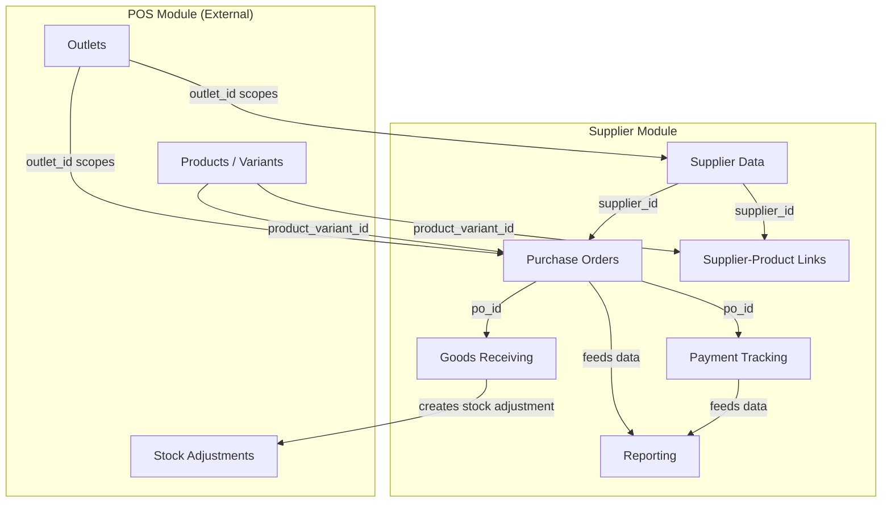
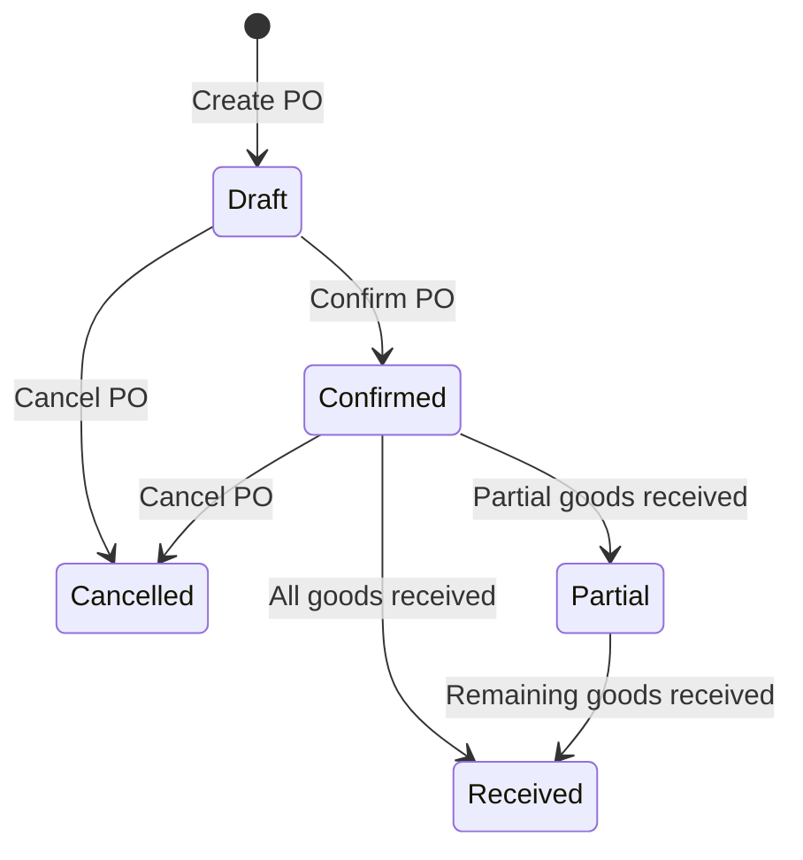
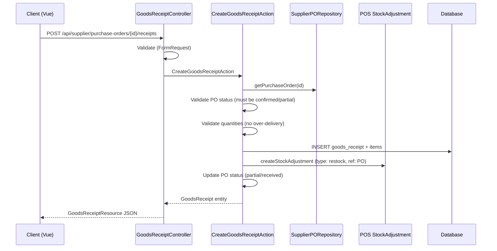
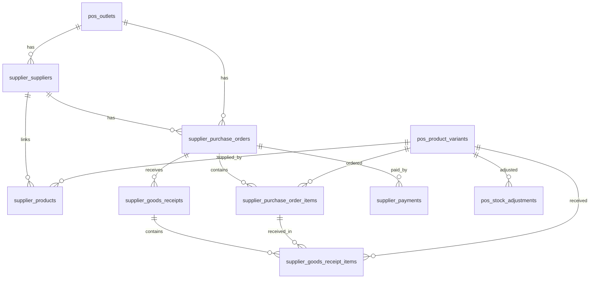

# Design Document — Supplier Module

## Overview

The Supplier module is a self-contained DDD module (`src/Modules/Supplier/`) that provides procurement and supplier management capabilities for the POS system. It follows the established 3-layer architecture (Domain → Application → Infrastructure) and integrates with the existing POS module's product catalog and stock management.

### Design Decisions

1. **Separate module namespace `Supplier`** — Lives alongside `Pos` as a peer module. While it integrates with POS products/stock, the procurement domain is distinct enough to warrant its own module.
2. **Outlet-scoped data** — All supplier data is scoped to `outlet_id`, consistent with POS module scoping. A supplier in one outlet is independent of suppliers in another.
3. **Stock integration via POS mechanism** — Goods receiving creates stock adjustments using the existing `pos_stock_adjustments` table with type "restock" and a reference to the purchase order, reusing the POS stock infrastructure.
4. **Table prefix `supplier_`** — All Supplier tables use `supplier_` prefix to avoid naming collisions, consistent with the `pos_` convention.
5. **PO lifecycle as state machine** — Purchase orders follow a strict state machine: draft → confirmed → partial/received (or cancelled from draft/confirmed). This prevents invalid state transitions.
6. **Soft-delete suppliers** — Suppliers are soft-deleted to preserve historical PO data integrity.
7. **No FK constraints** — Consistent with project convention, all references use `unsignedBigInteger` without foreign key constraints.
8. **All monetary values as `decimal(15,2)`** — Consistent with POS module.
9. **Multiple goods receipts per PO** — Supports split deliveries with partial receiving and over-delivery prevention.
10. **Payment tracking at PO level** — Payments are recorded against specific purchase orders, enabling per-PO and per-supplier debt tracking.

## Architecture

### Module Structure

```
src/Modules/Supplier/
├── Domain/
│   ├── Entities/
│   │   ├── Supplier.php
│   │   ├── PurchaseOrder.php
│   │   ├── PurchaseOrderItem.php
│   │   ├── GoodsReceipt.php
│   │   ├── GoodsReceiptItem.php
│   │   ├── SupplierPayment.php
│   │   └── SupplierProduct.php
│   ├── Enums/
│   │   ├── PurchaseOrderStatus.php
│   │   ├── PaymentStatus.php
│   │   └── PaymentMethod.php
│   ├── Contracts/
│   │   ├── SupplierRepositoryInterface.php
│   │   ├── PurchaseOrderRepositoryInterface.php
│   │   ├── GoodsReceiptRepositoryInterface.php
│   │   ├── SupplierPaymentRepositoryInterface.php
│   │   └── SupplierProductRepositoryInterface.php
│   └── Exceptions/
│       ├── DuplicateSupplierException.php
│       ├── InvalidPurchaseOrderStateException.php
│       ├── OverDeliveryException.php
│       ├── OverPaymentException.php
│       └── EmptyPurchaseOrderException.php
│
├── Application/
│   ├── Actions/
│   │   ├── Supplier/
│   │   │   ├── CreateSupplierAction.php
│   │   │   ├── UpdateSupplierAction.php
│   │   │   └── DeleteSupplierAction.php
│   │   ├── PurchaseOrder/
│   │   │   ├── CreatePurchaseOrderAction.php
│   │   │   ├── UpdatePurchaseOrderAction.php
│   │   │   ├── ConfirmPurchaseOrderAction.php
│   │   │   └── CancelPurchaseOrderAction.php
│   │   ├── GoodsReceipt/
│   │   │   └── CreateGoodsReceiptAction.php
│   │   ├── Payment/
│   │   │   └── RecordPaymentAction.php
│   │   └── SupplierProduct/
│   │       ├── LinkProductAction.php
│   │       └── UnlinkProductAction.php
│   ├── DTO/
│   │   ├── SupplierData.php
│   │   ├── PurchaseOrderData.php
│   │   ├── PurchaseOrderItemData.php
│   │   ├── GoodsReceiptData.php
│   │   ├── GoodsReceiptItemData.php
│   │   ├── SupplierPaymentData.php
│   │   └── SupplierProductData.php
│   └── Queries/
│       ├── PurchaseSummaryQuery.php
│       ├── PurchaseBySupplierQuery.php
│       ├── PurchaseByProductQuery.php
│       └── SupplierDashboardQuery.php
│
└── Infrastructure/
    ├── Controllers/
    │   ├── SupplierController.php
    │   ├── PurchaseOrderController.php
    │   ├── GoodsReceiptController.php
    │   ├── SupplierPaymentController.php
    │   ├── SupplierProductController.php
    │   └── SupplierReportController.php
    ├── Models/
    │   ├── SupplierModel.php
    │   ├── PurchaseOrderModel.php
    │   ├── PurchaseOrderItemModel.php
    │   ├── GoodsReceiptModel.php
    │   ├── GoodsReceiptItemModel.php
    │   ├── SupplierPaymentModel.php
    │   └── SupplierProductModel.php
    ├── Repositories/
    │   ├── EloquentSupplierRepository.php
    │   ├── EloquentPurchaseOrderRepository.php
    │   ├── EloquentGoodsReceiptRepository.php
    │   ├── EloquentSupplierPaymentRepository.php
    │   └── EloquentSupplierProductRepository.php
    ├── Requests/
    │   ├── StoreSupplierRequest.php
    │   ├── UpdateSupplierRequest.php
    │   ├── StorePurchaseOrderRequest.php
    │   ├── UpdatePurchaseOrderRequest.php
    │   ├── StoreGoodsReceiptRequest.php
    │   ├── StoreSupplierPaymentRequest.php
    │   ├── LinkProductRequest.php
    │   └── ExportReportRequest.php
    ├── Resources/
    │   ├── SupplierResource.php
    │   ├── SupplierListResource.php
    │   ├── PurchaseOrderResource.php
    │   ├── PurchaseOrderListResource.php
    │   ├── PurchaseOrderItemResource.php
    │   ├── GoodsReceiptResource.php
    │   ├── SupplierPaymentResource.php
    │   ├── SupplierProductResource.php
    │   └── PurchaseReportResource.php
    ├── Providers/
    │   └── SupplierServiceProvider.php
    └── Routes/
        └── api.php
```

### Sub-Module Interaction Diagram



### Purchase Order Lifecycle



### Request Flow (Goods Receiving)



## Components and Interfaces

### Domain Contracts

```php
interface SupplierRepositoryInterface {
    public function findByOutletPaginated(int $outletId, array $filters, int $perPage): array;
    public function findById(int $id): ?Supplier;
    public function create(int $outletId, SupplierData $data): Supplier;
    public function update(int $id, SupplierData $data): Supplier;
    public function softDelete(int $id): void;
    public function search(int $outletId, string $query): array;
    public function existsByName(int $outletId, string $name, ?int $excludeId = null): bool;
    public function getTotalDebt(int $supplierId): float;
}

interface PurchaseOrderRepositoryInterface {
    public function findByOutletPaginated(int $outletId, array $filters, int $perPage): array;
    public function findById(int $id): ?PurchaseOrder;
    public function create(int $outletId, PurchaseOrderData $data): PurchaseOrder;
    public function update(int $id, PurchaseOrderData $data): PurchaseOrder;
    public function updateStatus(int $id, PurchaseOrderStatus $status): void;
    public function updatePaymentStatus(int $id, PaymentStatus $status): void;
    public function generatePoNumber(int $outletId): string;
    public function findBySupplier(int $supplierId, array $filters, int $perPage): array;
    public function getOutstandingBySupplier(int $supplierId): float;
    public function getTotalPaid(int $purchaseOrderId): float;
}

interface GoodsReceiptRepositoryInterface {
    public function findByPurchaseOrder(int $purchaseOrderId): array;
    public function create(int $purchaseOrderId, GoodsReceiptData $data): GoodsReceipt;
    public function getTotalReceivedByItem(int $purchaseOrderItemId): int;
}

interface SupplierPaymentRepositoryInterface {
    public function findByPurchaseOrder(int $purchaseOrderId): array;
    public function findBySupplierPaginated(int $supplierId, int $perPage): array;
    public function create(SupplierPaymentData $data): SupplierPayment;
    public function getTotalPaidForPO(int $purchaseOrderId): float;
}

interface SupplierProductRepositoryInterface {
    public function findBySupplier(int $supplierId): array;
    public function findByProductVariant(int $productVariantId): array;
    public function link(int $supplierId, SupplierProductData $data): SupplierProduct;
    public function unlink(int $supplierId, int $productVariantId): void;
    public function getDefaultCost(int $supplierId, int $productVariantId): ?float;
}
```

### Domain Enums

```php
enum PurchaseOrderStatus: string {
    case Draft = 'draft';
    case Confirmed = 'confirmed';
    case Partial = 'partial';
    case Received = 'received';
    case Cancelled = 'cancelled';
}

enum PaymentStatus: string {
    case Unpaid = 'unpaid';
    case Partial = 'partial';
    case Paid = 'paid';
}

enum PaymentMethod: string {
    case Cash = 'cash';
    case BankTransfer = 'bank_transfer';
    case EWallet = 'e_wallet';
}
```

### Key Domain Entities

```php
class Supplier {
    public function __construct(
        public ?int $id,
        public int $outletId,
        public string $name,
        public ?string $address = null,
        public ?string $phone = null,
        public ?string $email = null,
        public ?string $bankName = null,
        public ?string $bankAccountNumber = null,
        public ?string $bankAccountHolder = null,
        public ?string $notes = null,
        public ?DateTimeImmutable $createdAt = null,
        public ?DateTimeImmutable $updatedAt = null,
        public ?DateTimeImmutable $deletedAt = null,
    ) {}
}

class PurchaseOrder {
    public function __construct(
        public ?int $id,
        public int $outletId,
        public int $supplierId,
        public string $poNumber,
        public string $orderDate,
        public ?string $expectedDeliveryDate = null,
        public PurchaseOrderStatus $status = PurchaseOrderStatus::Draft,
        public PaymentStatus $paymentStatus = PaymentStatus::Unpaid,
        public decimal $totalAmount = 0,
        public ?string $notes = null,
        public ?DateTimeImmutable $cancelledAt = null,
        public ?DateTimeImmutable $createdAt = null,
        public ?DateTimeImmutable $updatedAt = null,
        /** @var PurchaseOrderItem[] */
        public array $items = [],
    ) {}

    public function isDraft(): bool
    {
        return $this->status === PurchaseOrderStatus::Draft;
    }

    public function isEditable(): bool
    {
        return $this->status === PurchaseOrderStatus::Draft;
    }

    public function isCancellable(): bool
    {
        return in_array($this->status, [
            PurchaseOrderStatus::Draft,
            PurchaseOrderStatus::Confirmed,
        ]);
    }

    public function canReceiveGoods(): bool
    {
        return in_array($this->status, [
            PurchaseOrderStatus::Confirmed,
            PurchaseOrderStatus::Partial,
        ]);
    }

    public function getOutstandingBalance(): float
    {
        // totalAmount - totalPaid (calculated externally)
        return $this->totalAmount;
    }
}

class PurchaseOrderItem {
    public function __construct(
        public ?int $id,
        public int $purchaseOrderId,
        public int $productVariantId,
        public string $productName,
        public string $variantName,
        public int $quantity,
        public decimal $unitCost,
        public decimal $subtotal,
        public int $receivedQuantity = 0,
    ) {}

    public function getRemainingQuantity(): int
    {
        return $this->quantity - $this->receivedQuantity;
    }

    public function isFullyReceived(): bool
    {
        return $this->receivedQuantity >= $this->quantity;
    }
}

class GoodsReceipt {
    public function __construct(
        public ?int $id,
        public int $purchaseOrderId,
        public string $receiptDate,
        public ?string $notes = null,
        public ?DateTimeImmutable $createdAt = null,
        /** @var GoodsReceiptItem[] */
        public array $items = [],
    ) {}
}

class GoodsReceiptItem {
    public function __construct(
        public ?int $id,
        public int $goodsReceiptId,
        public int $purchaseOrderItemId,
        public int $productVariantId,
        public int $quantity,
    ) {}
}

class SupplierPayment {
    public function __construct(
        public ?int $id,
        public int $purchaseOrderId,
        public decimal $amount,
        public string $paymentDate,
        public PaymentMethod $paymentMethod,
        public ?string $notes = null,
        public ?DateTimeImmutable $createdAt = null,
    ) {}
}

class SupplierProduct {
    public function __construct(
        public ?int $id,
        public int $supplierId,
        public int $productVariantId,
        public ?decimal $defaultUnitCost = null,
        public ?string $productName = null,
        public ?string $variantName = null,
    ) {}
}
```

### API Endpoints

All routes are prefixed with `/api/supplier/` and require `auth:sanctum` middleware.

#### Suppliers

| Method | Endpoint | Controller Method | Description |
|--------|----------|-------------------|-------------|
| GET | `/supplier/outlets/{outletId}/suppliers` | index | List suppliers (paginated, searchable) |
| POST | `/supplier/outlets/{outletId}/suppliers` | store | Create supplier |
| GET | `/supplier/suppliers/{id}` | show | Supplier detail + debt summary |
| PUT | `/supplier/suppliers/{id}` | update | Update supplier |
| DELETE | `/supplier/suppliers/{id}` | destroy | Soft-delete supplier |
| GET | `/supplier/outlets/{outletId}/suppliers/search` | search | Quick search by name/phone/email |

#### Purchase Orders

| Method | Endpoint | Controller Method | Description |
|--------|----------|-------------------|-------------|
| GET | `/supplier/outlets/{outletId}/purchase-orders` | index | List POs (paginated, filterable) |
| POST | `/supplier/outlets/{outletId}/purchase-orders` | store | Create PO (draft) |
| GET | `/supplier/purchase-orders/{id}` | show | PO detail with items, receipts, payments |
| PUT | `/supplier/purchase-orders/{id}` | update | Update PO (draft only) |
| POST | `/supplier/purchase-orders/{id}/confirm` | confirm | Confirm PO (draft → confirmed) |
| POST | `/supplier/purchase-orders/{id}/cancel` | cancel | Cancel PO |

#### Goods Receipts

| Method | Endpoint | Controller Method | Description |
|--------|----------|-------------------|-------------|
| GET | `/supplier/purchase-orders/{id}/receipts` | index | List receipts for a PO |
| POST | `/supplier/purchase-orders/{id}/receipts` | store | Create goods receipt + update stock |

#### Payments

| Method | Endpoint | Controller Method | Description |
|--------|----------|-------------------|-------------|
| GET | `/supplier/purchase-orders/{id}/payments` | indexByPO | List payments for a PO |
| GET | `/supplier/suppliers/{id}/payments` | indexBySupplier | List payments for a supplier |
| POST | `/supplier/purchase-orders/{id}/payments` | store | Record payment against PO |

#### Supplier-Product Links

| Method | Endpoint | Controller Method | Description |
|--------|----------|-------------------|-------------|
| GET | `/supplier/suppliers/{id}/products` | index | List linked products |
| POST | `/supplier/suppliers/{id}/products` | link | Link product variant to supplier |
| DELETE | `/supplier/suppliers/{id}/products/{variantId}` | unlink | Remove link |

#### Reports

| Method | Endpoint | Controller Method | Description |
|--------|----------|-------------------|-------------|
| GET | `/supplier/outlets/{outletId}/reports/summary` | summary | Purchase summary (total, paid, debt) |
| GET | `/supplier/outlets/{outletId}/reports/by-supplier` | bySupplier | Grouped by supplier |
| GET | `/supplier/outlets/{outletId}/reports/by-product` | byProduct | Grouped by product |
| GET | `/supplier/outlets/{outletId}/reports/export` | export | CSV export |
| GET | `/supplier/outlets/{outletId}/dashboard` | dashboard | Supplier dashboard widget |

## Data Models

### Database Schema

All tables use `supplier_` prefix. Foreign references use `unsignedBigInteger` without FK constraints. Enum-like fields stored as `string`.

#### `supplier_suppliers`

| Column | Type | Notes |
|--------|------|-------|
| id | bigIncrements | PK |
| outlet_id | unsignedBigInteger | Scoped to outlet |
| name | string(100) | Supplier name |
| address | text, nullable | |
| phone | string(20), nullable | |
| email | string(150), nullable | |
| bank_name | string(50), nullable | |
| bank_account_number | string(30), nullable | |
| bank_account_holder | string(100), nullable | |
| notes | text, nullable | |
| created_at | timestamps | |
| updated_at | timestamps | |
| deleted_at | softDeletes | |

Indexes: `outlet_id`, unique(`outlet_id`, `name`) with soft-delete consideration, index(`outlet_id`, `phone`), index(`outlet_id`, `email`)

#### `supplier_purchase_orders`

| Column | Type | Notes |
|--------|------|-------|
| id | bigIncrements | PK |
| outlet_id | unsignedBigInteger | |
| supplier_id | unsignedBigInteger | |
| po_number | string(30) | Unique, format: PO-{YYYYMMDD}-{SEQ} |
| order_date | date | |
| expected_delivery_date | date, nullable | |
| status | string(20), default 'draft' | draft, confirmed, partial, received, cancelled |
| payment_status | string(20), default 'unpaid' | unpaid, partial, paid |
| total_amount | decimal(15,2), default 0 | Sum of line item subtotals |
| notes | text, nullable | |
| cancelled_at | timestamp, nullable | |
| created_at | timestamps | |
| updated_at | timestamps | |

Indexes: `outlet_id`, `supplier_id`, `status`, `payment_status`, unique(`po_number`), `order_date`

#### `supplier_purchase_order_items`

| Column | Type | Notes |
|--------|------|-------|
| id | bigIncrements | PK |
| purchase_order_id | unsignedBigInteger | |
| product_variant_id | unsignedBigInteger | References pos_product_variants |
| product_name | string(150) | Snapshot at time of creation |
| variant_name | string(100) | Snapshot |
| quantity | unsignedInteger | Ordered quantity |
| unit_cost | decimal(15,2) | Harga beli per unit |
| subtotal | decimal(15,2) | quantity × unit_cost |
| received_quantity | unsignedInteger, default 0 | Running total of received |

Indexes: `purchase_order_id`, `product_variant_id`

#### `supplier_goods_receipts`

| Column | Type | Notes |
|--------|------|-------|
| id | bigIncrements | PK |
| purchase_order_id | unsignedBigInteger | |
| receipt_date | date | |
| notes | text, nullable | |
| created_at | timestamps | |

Indexes: `purchase_order_id`, `receipt_date`

#### `supplier_goods_receipt_items`

| Column | Type | Notes |
|--------|------|-------|
| id | bigIncrements | PK |
| goods_receipt_id | unsignedBigInteger | |
| purchase_order_item_id | unsignedBigInteger | |
| product_variant_id | unsignedBigInteger | For direct stock update reference |
| quantity | unsignedInteger | Received quantity in this receipt |

Indexes: `goods_receipt_id`, `purchase_order_item_id`

#### `supplier_payments`

| Column | Type | Notes |
|--------|------|-------|
| id | bigIncrements | PK |
| purchase_order_id | unsignedBigInteger | |
| amount | decimal(15,2) | Payment amount |
| payment_date | date | |
| payment_method | string(20) | cash, bank_transfer, e_wallet |
| notes | text, nullable | |
| created_at | timestamps | |

Indexes: `purchase_order_id`, `payment_date`

#### `supplier_products`

| Column | Type | Notes |
|--------|------|-------|
| id | bigIncrements | PK |
| supplier_id | unsignedBigInteger | |
| product_variant_id | unsignedBigInteger | References pos_product_variants |
| default_unit_cost | decimal(15,2), nullable | Default harga beli |
| created_at | timestamps | |
| updated_at | timestamps | |

Indexes: unique(`supplier_id`, `product_variant_id`), `product_variant_id`

### Entity Relationship Diagram



### Frontend Component Architecture

```
resources/js/
├── types/supplier.ts                → All Supplier interfaces
├── api/supplier.ts                  → All Supplier API calls
└── pages/supplier/
    ├── Index.vue                    → Supplier module dashboard
    ├── suppliers/
    │   ├── Index.vue               → Supplier list (paginated, searchable)
    │   ├── Detail.vue              → Supplier detail (info + products + debt)
    │   └── SupplierForm.vue        → Create/edit supplier modal
    ├── purchase-orders/
    │   ├── Index.vue               → PO list (paginated, filterable)
    │   ├── Detail.vue              → PO detail (items, receipts, payments)
    │   ├── Create.vue              → Create/edit PO page (full page form)
    │   └── GoodsReceiptForm.vue    → Record goods receipt modal
    ├── payments/
    │   └── PaymentForm.vue         → Record payment modal
    └── reports/
        ├── Index.vue               → Purchase reports dashboard
        └── PurchaseSummary.vue     → Summary with date range filter
```

### Frontend Types (`resources/js/types/supplier.ts`)

```typescript
export interface Supplier {
  id: number
  outlet_id: number
  name: string
  address: string | null
  phone: string | null
  email: string | null
  bank_name: string | null
  bank_account_number: string | null
  bank_account_holder: string | null
  notes: string | null
  total_debt: number
  created_at: string
  updated_at: string
}

export interface SupplierPayload {
  name: string
  address?: string | null
  phone?: string | null
  email?: string | null
  bank_name?: string | null
  bank_account_number?: string | null
  bank_account_holder?: string | null
  notes?: string | null
}

export interface PurchaseOrder {
  id: number
  outlet_id: number
  supplier_id: number
  supplier_name: string
  po_number: string
  order_date: string
  expected_delivery_date: string | null
  status: 'draft' | 'confirmed' | 'partial' | 'received' | 'cancelled'
  payment_status: 'unpaid' | 'partial' | 'paid'
  total_amount: number
  total_paid: number
  outstanding_balance: number
  notes: string | null
  cancelled_at: string | null
  items: PurchaseOrderItem[]
  created_at: string
  updated_at: string
}

export interface PurchaseOrderItem {
  id: number
  purchase_order_id: number
  product_variant_id: number
  product_name: string
  variant_name: string
  quantity: number
  unit_cost: number
  subtotal: number
  received_quantity: number
}

export interface PurchaseOrderPayload {
  supplier_id: number
  order_date: string
  expected_delivery_date?: string | null
  notes?: string | null
  items: PurchaseOrderItemPayload[]
}

export interface PurchaseOrderItemPayload {
  product_variant_id: number
  product_name: string
  variant_name: string
  quantity: number
  unit_cost: number
}

export interface GoodsReceipt {
  id: number
  purchase_order_id: number
  receipt_date: string
  notes: string | null
  items: GoodsReceiptItem[]
  created_at: string
}

export interface GoodsReceiptItem {
  id: number
  goods_receipt_id: number
  purchase_order_item_id: number
  product_variant_id: number
  quantity: number
}

export interface GoodsReceiptPayload {
  receipt_date: string
  notes?: string | null
  items: GoodsReceiptItemPayload[]
}

export interface GoodsReceiptItemPayload {
  purchase_order_item_id: number
  product_variant_id: number
  quantity: number
}

export interface SupplierPayment {
  id: number
  purchase_order_id: number
  amount: number
  payment_date: string
  payment_method: 'cash' | 'bank_transfer' | 'e_wallet'
  notes: string | null
  created_at: string
}

export interface SupplierPaymentPayload {
  amount: number
  payment_date: string
  payment_method: 'cash' | 'bank_transfer' | 'e_wallet'
  notes?: string | null
}

export interface SupplierProduct {
  id: number
  supplier_id: number
  product_variant_id: number
  product_name: string
  variant_name: string
  default_unit_cost: number | null
}

export interface LinkProductPayload {
  product_variant_id: number
  default_unit_cost?: number | null
}

export interface PurchaseSummary {
  total_purchase_value: number
  total_paid: number
  total_outstanding_debt: number
  purchase_count: number
}

export interface PurchaseBySupplier {
  supplier_id: number
  supplier_name: string
  total_purchase: number
  outstanding_debt: number
}

export interface PurchaseByProduct {
  product_variant_id: number
  product_name: string
  variant_name: string
  total_quantity: number
  total_cost: number
}

export interface SupplierDashboard {
  total_outstanding_debt: number
  pending_po_count: number
  recent_purchase_orders: PurchaseOrder[]
}
```

## Correctness Properties

*A property is a characteristic or behavior that should hold true across all valid executions of a system — essentially, a formal statement about what the system should do. Properties serve as the bridge between human-readable specifications and machine-verifiable correctness guarantees.*

### Property 1: Supplier data persistence round-trip

*For any* valid supplier data (name, optional address, phone, email, bank details, notes), creating a supplier and then retrieving it SHALL return the same data values. Updating any field and then retrieving SHALL reflect the updated values.

**Validates: Requirements 1.1, 1.2**

### Property 2: Supplier soft-delete preserves PO history

*For any* supplier with associated purchase orders, soft-deleting the supplier SHALL remove it from listing/search results, AND all purchase orders previously associated with that supplier SHALL retain their data (items, totals, payments, receipts) intact.

**Validates: Requirements 1.3**

### Property 3: Supplier search completeness

*For any* search query string, the results SHALL include all non-deleted suppliers where the query matches the supplier name, phone number, or email (case-insensitive partial match), and SHALL exclude suppliers that do not match any of these fields.

**Validates: Requirements 1.4**

### Property 4: Supplier name uniqueness constraint

*For any* supplier creation or update within an outlet, if a non-deleted supplier with the same name already exists in the same outlet, the operation SHALL be rejected with a duplicate error.

**Validates: Requirements 1.6**

### Property 5: Outlet scoping isolation

*For any* supplier created in outlet A, querying suppliers from outlet B SHALL NOT include that supplier. This applies to all supplier-scoped data (purchase orders, payments, reports).

**Validates: Requirements 1.7**

### Property 6: PO number format and uniqueness

*For any* purchase order created on a given date, the PO number SHALL match the format `PO-{YYYYMMDD}-{sequential}` AND shall be unique across all purchase orders in the system.

**Validates: Requirements 2.2**

### Property 7: PO total calculation invariant

*For any* purchase order containing one or more line items, the total_amount SHALL equal the sum of (quantity × unit_cost) for all line items. Adding, removing, or modifying a line item SHALL maintain this invariant.

**Validates: Requirements 2.4**

### Property 8: PO initial state invariant

*For any* newly created purchase order, the status SHALL be "draft" and the payment_status SHALL be "unpaid".

**Validates: Requirements 2.5, 2.7**

### Property 9: PO editability by state

*For any* purchase order in "draft" status, editing all fields (including line items) SHALL succeed. *For any* purchase order in "confirmed", "partial", "received", or "cancelled" status, editing line items SHALL be rejected.

**Validates: Requirements 2.6, 2.8**

### Property 10: PO confirmation requires line items

*For any* purchase order with zero line items, confirming the order SHALL be rejected with an error. *For any* purchase order with one or more line items in "draft" status, confirmation SHALL succeed and transition status to "confirmed" with payment_status "unpaid".

**Validates: Requirements 2.7, 2.9**

### Property 11: PO cancellation state guard

*For any* purchase order in "draft" or "confirmed" status, cancellation SHALL succeed and set status to "cancelled" with a cancellation timestamp. *For any* purchase order in "partial" or "received" status, cancellation SHALL be rejected.

**Validates: Requirements 3.1, 3.2, 3.3**

### Property 12: Cancelled PO excluded from debt

*For any* cancelled purchase order, it SHALL NOT contribute to the supplier's total outstanding debt calculation, regardless of its total_amount or payment history.

**Validates: Requirements 3.4**

### Property 13: Goods receipt updates POS stock

*For any* goods receipt with received quantities, the POS stock for each product variant SHALL increase by the received quantity via a stock adjustment of type "restock" referencing the purchase order.

**Validates: Requirements 4.2**

### Property 14: Over-delivery prevention

*For any* goods receipt line item where the specified quantity exceeds the remaining undelivered quantity (ordered quantity minus previously received quantity), the receipt SHALL be rejected with an over-delivery error.

**Validates: Requirements 4.8**

### Property 15: PO receiving status determination

*For any* purchase order after processing a goods receipt: IF all line items have received_quantity equal to ordered quantity, status SHALL be "received". IF some but not all line items are fully received (or some have partial receipt), status SHALL be "partial". The status SHALL never regress from "received" to "partial".

**Validates: Requirements 4.4, 4.5**

### Property 16: Goods receipt state guard

*For any* purchase order in "draft" or "cancelled" status, creating a goods receipt SHALL be rejected. Only "confirmed" or "partial" status POs SHALL accept goods receipts.

**Validates: Requirements 4.9**

### Property 17: Payment status determination

*For any* purchase order, after recording a payment: IF total payments equal or exceed PO total_amount, payment_status SHALL be "paid". IF total payments are greater than zero but less than PO total_amount, payment_status SHALL be "partial". IF no payments exist, payment_status SHALL be "unpaid".

**Validates: Requirements 6.2**

### Property 18: Overpayment prevention

*For any* payment where the amount exceeds the outstanding balance (PO total_amount minus sum of existing payments), the payment SHALL be rejected with an overpayment error.

**Validates: Requirements 6.3**

### Property 19: Supplier outstanding debt calculation

*For any* supplier, the total outstanding debt SHALL equal the sum of (total_amount - total_paid) for all non-cancelled purchase orders associated with that supplier. Cancelled POs contribute zero to debt.

**Validates: Requirements 6.4, 6.7**

### Property 20: Supplier-product link many-to-many

*For any* supplier and product variant, linking SHALL succeed and store the optional default_unit_cost. A single product variant MAY be linked to multiple suppliers, and a single supplier MAY be linked to multiple product variants, each with independent default_unit_cost values.

**Validates: Requirements 7.1, 7.4, 7.5**

### Property 21: Default unit cost pre-fill

*For any* PO line item where the selected product variant has a supplier-product link with a default_unit_cost, the system SHALL return the default_unit_cost for pre-filling. If no link exists, no pre-fill value is returned.

**Validates: Requirements 7.2**

### Property 22: Supplier-product unlink preserves PO history

*For any* supplier-product link that is removed, all historical purchase order items referencing that product variant from that supplier SHALL retain their data (product_name, variant_name, quantity, unit_cost) intact.

**Validates: Requirements 7.6**

### Property 23: Report aggregation consistency

*For any* date range, the purchase summary total_purchase_value SHALL equal the sum of all per-supplier purchase totals, AND SHALL equal the sum of all per-product total costs. Only non-cancelled POs within the date range contribute to these totals.

**Validates: Requirements 8.1, 8.2, 8.3**

### Property 24: PO list ordering invariant

*For any* purchase order history query, the results SHALL be sorted by order_date descending (most recent first), and pagination SHALL maintain this ordering across pages.

**Validates: Requirements 5.1**

## Error Handling

### Domain Exceptions

| Exception | When Thrown | HTTP Status |
|-----------|------------|-------------|
| `DuplicateSupplierException` | Supplier name already exists in same outlet | 409 |
| `InvalidPurchaseOrderStateException` | Invalid state transition (e.g., edit confirmed PO, cancel received PO) | 422 |
| `OverDeliveryException` | Received quantity exceeds remaining undelivered quantity | 422 |
| `OverPaymentException` | Payment amount exceeds outstanding balance | 422 |
| `EmptyPurchaseOrderException` | Attempting to confirm PO with zero line items | 422 |

### Error Response Format

```json
{
  "message": "Nama supplier sudah digunakan di outlet ini.",
  "errors": {
    "name": ["Supplier dengan nama ini sudah ada."]
  }
}
```

### Validation Strategy

- **FormRequest** handles structural validation (required fields, types, lengths, enum values)
- **Action** handles business rule validation (state checks, over-delivery, overpayment, uniqueness)
- Business exceptions are caught in the Controller and transformed to appropriate HTTP responses

### Error Scenarios by Sub-Module

**Supplier Data:**
- Duplicate supplier name in outlet → 409 with `DuplicateSupplierException`
- Supplier not found or not owned → 404
- Supplier deleted (soft-deleted) → 404

**Purchase Order:**
- Edit non-draft PO → 422 with `InvalidPurchaseOrderStateException` (message: "PO hanya bisa diubah saat status draft")
- Confirm PO with no items → 422 with `EmptyPurchaseOrderException` (message: "PO harus memiliki minimal 1 item")
- Cancel received/partial PO → 422 with `InvalidPurchaseOrderStateException` (message: "PO yang sudah diterima tidak bisa dibatalkan")
- PO not found or not owned → 404

**Goods Receiving:**
- Receive against draft/cancelled PO → 422 with `InvalidPurchaseOrderStateException` (message: "Penerimaan hanya untuk PO yang sudah dikonfirmasi")
- Over-delivery → 422 with `OverDeliveryException` (message: "Jumlah diterima melebihi sisa yang belum dikirim: {item_name}")
- Receipt with zero total quantity → 422 validation error

**Payment:**
- Overpayment → 422 with `OverPaymentException` (message: "Pembayaran melebihi sisa utang Rp {amount}")
- Payment for cancelled PO → 422 with `InvalidPurchaseOrderStateException`
- Payment for fully paid PO → 422 with `OverPaymentException`

**Supplier-Product:**
- Link already exists → 422 validation error (unique constraint)
- Product variant not found or not in outlet → 422 validation error

## Testing Strategy

### Property-Based Testing

The Supplier module contains significant business logic (PO state machine, goods receiving with over-delivery prevention, payment tracking with overpayment prevention, stock integration, financial calculations, report aggregation) that benefits from property-based testing.

**Library:** [PHPUnit](https://phpunit.de/) with [Eris](https://github.com/giorgiosironi/eris) for PHP property-based testing.

**Configuration:**
- Minimum 100 iterations per property test
- Each property test references its design document property number
- Tag format: `Feature: supplier, Property {number}: {property_text}`

**Property tests cover:**
- Supplier data round-trip persistence (Property 1)
- Supplier soft-delete preserves PO data (Property 2)
- Search completeness (Property 3)
- Name uniqueness constraint (Property 4)
- Outlet scoping isolation (Property 5)
- PO number format and uniqueness (Property 6)
- PO total calculation invariant (Property 7)
- PO initial state invariant (Property 8)
- PO editability by state (Property 9)
- PO confirmation requires items (Property 10)
- PO cancellation state guard (Property 11)
- Cancelled PO excluded from debt (Property 12)
- Goods receipt updates POS stock (Property 13)
- Over-delivery prevention (Property 14)
- PO receiving status determination (Property 15)
- Goods receipt state guard (Property 16)
- Payment status determination (Property 17)
- Overpayment prevention (Property 18)
- Supplier outstanding debt calculation (Property 19)
- Supplier-product many-to-many linking (Property 20)
- Default unit cost pre-fill (Property 21)
- Unlink preserves PO history (Property 22)
- Report aggregation consistency (Property 23)
- PO list ordering invariant (Property 24)

### Unit/Feature Testing

Feature tests (full HTTP flow) cover:
- CRUD operations for suppliers (create, read, update, soft-delete)
- Authorization and ownership checks (user can only access own outlet data)
- Validation rules (FormRequest validation for all endpoints)
- PO lifecycle: create (draft), edit, confirm, receive, cancel
- PO line item management: add, remove, modify (draft only)
- Goods receiving: full receipt, partial receipt, split delivery, over-delivery rejection
- Payment recording: single payment, installments, full payment, overpayment rejection
- Supplier-product linking: link, unlink, default cost lookup
- Report generation with known data sets
- CSV export format validation
- Search by name/phone/email
- Pagination and sorting
- Edge cases: zero-item PO confirmation, payment on cancelled PO, receipt on draft PO

### Test Structure

```
tests/Feature/Supplier/
├── SupplierTest.php
├── PurchaseOrderTest.php
├── PurchaseOrderConfirmTest.php
├── PurchaseOrderCancelTest.php
├── GoodsReceiptTest.php
├── SupplierPaymentTest.php
├── SupplierProductTest.php
└── SupplierReportTest.php

tests/Property/Supplier/
├── SupplierDataPropertyTest.php
├── PurchaseOrderCalculationPropertyTest.php
├── PurchaseOrderStatePropertyTest.php
├── GoodsReceivingPropertyTest.php
├── PaymentTrackingPropertyTest.php
├── SupplierProductPropertyTest.php
└── ReportAggregationPropertyTest.php
```

### Integration Points to Test

- Goods receipt → POS stock adjustment creation (atomicity)
- PO total recalculation on line item changes
- Payment recording → payment_status transition
- Goods receipt → PO status transition (partial/received)
- Supplier deletion → PO data preservation
- Supplier-product unlink → PO item data preservation
- Report aggregation excludes cancelled POs
- Outlet scoping across all queries
