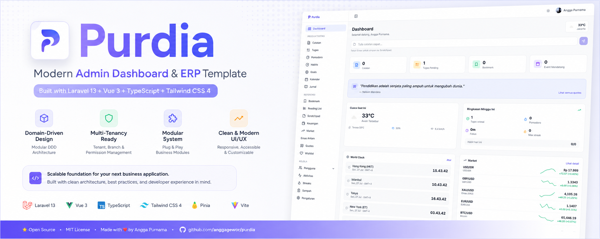

<p align="center">
  
</p>
# Purdia Dashboard

Personal productivity dashboard yang dibangun dengan Laravel 13 (DDD Modular) dan Vue 3 + TypeScript.

## Tech Stack

**Backend:**
- PHP 8.3 + Laravel 13
- DDD Layered Modular Architecture (`src/Modules/`)
- Laravel Sanctum (token-based auth)
- MariaDB (production) / SQLite (testing)

**Frontend:**
- Vue 3 + TypeScript (Composition API)
- Pinia (state management)
- Vue Router
- Tailwind CSS 4
- Vite 8

**Internal Packages (monorepo `packages/`):**
- `@purdia/auth` — Authentication store & route guard
- `@purdia/http` — HTTP client with silent token refresh & global error handling
- `@purdia/toast` — Toast notification system (Pinia store + component)
- `@purdia/composables` — Reusable composables (useApi, usePagination)
- `@purdia/ui` — Component library (40+ komponen)
- `@purdia/charts` — Chart components (Bar, Line, Doughnut)
- `@purdia/utils` — Utility functions (format, timing, misc)
- `@purdia/theme` — Dark/light mode & color scheme
- `@purdia/crypto` — Encrypted localStorage
- `@purdia/tailwind` — Shared Tailwind config & tokens

## Fitur

Lihat [FEATURES.md](./FEATURES.md) untuk daftar lengkap fitur.

**Ringkasan:**
- 🔐 Authentication (login, register, token refresh)
- 📝 Notes dengan rich text editor & pin
- 🔖 Bookmarks dengan kategori
- ✅ Task management (status, priority, reorder, recurrence)
- 📅 Calendar events & hari libur nasional
- 🍅 Pomodoro timer
- 📋 Scratchpads (quick notes)
- 🎯 Habit tracker (daily/weekly + streak)
- 💰 Finance tracker (income/expense + summary)
- 📈 Market watchlist (forex, crypto, stock via Twelve Data + sparkline)
- 🪙 Emas Antam (harga harian + chart historis 15 tahun)
- 📚 Reading list
- 📓 Daily journal & mood tracker
- 🏆 Goals & milestones
- 🎁 Wishlist
- 🏷️ Tags (polymorphic, attach ke notes/tasks)
- 💬 Daily motivational quotes (CRUD + quote of the day)
- 🗑️ Unified trash (restore / permanent delete)
- 📊 Dashboard (weekly summary, weather, world clock, market widget, gold widget, quick capture)
- 🌐 World Clock (configurable timezones, live update)
- ⚙️ Settings (profile, appearance, market watchlist, export)

## Arsitektur

```
src/Modules/
├── {Module}/
│   ├── Domain/           → Entities, Enums, Contracts (pure PHP)
│   ├── Application/      → Actions (use cases), DTOs
│   └── Infrastructure/   → Controllers, Models, Repositories, Routes, Migrations
└── Shared/               → Cross-module traits, contracts

app/                      → Laravel boilerplate (providers, middleware)
resources/js/             → Vue 3 SPA
packages/                 → @purdia/* internal packages
```

Dependency rule: `Domain ← Application ← Infrastructure`

## Setup

```bash
# Install dependencies & setup database
composer setup

# Atau manual:
composer install
cp .env.example .env
php artisan key:generate
php artisan migrate
npm install
npm run build
```

## Development

```bash
composer dev
```

Ini akan jalankan secara bersamaan:
- Laravel dev server (`php artisan serve`)
- Queue worker
- Log viewer (Pail)
- Vite HMR

## Testing

```bash
php artisan test --testsuite=Feature
```

Tests menggunakan SQLite in-memory. Semua module punya feature test.

## Build

```bash
npm run build
```

## API

Setiap module punya route sendiri di `src/Modules/{Module}/Infrastructure/Routes/api.php`. Format response konsisten:

```json
{
  "data": { ... },
  "message": "optional",
  "meta": { "current_page": 1, "last_page": 5, "per_page": 10, "total": 50 }
}
```

Auth menggunakan Bearer token (Sanctum). Prefix: `/api/`.
